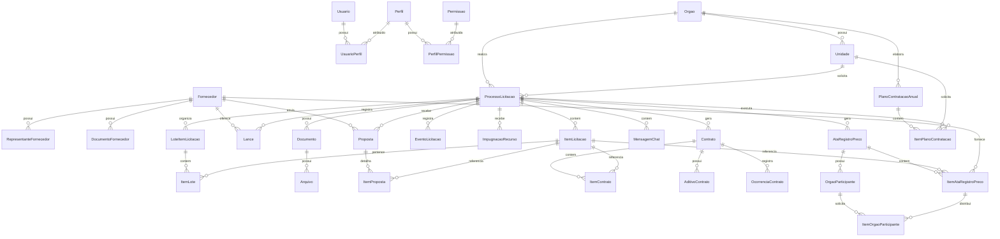
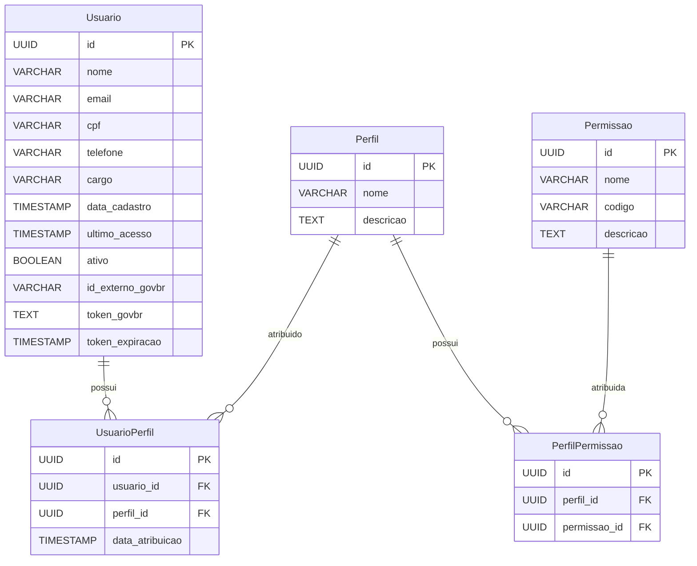
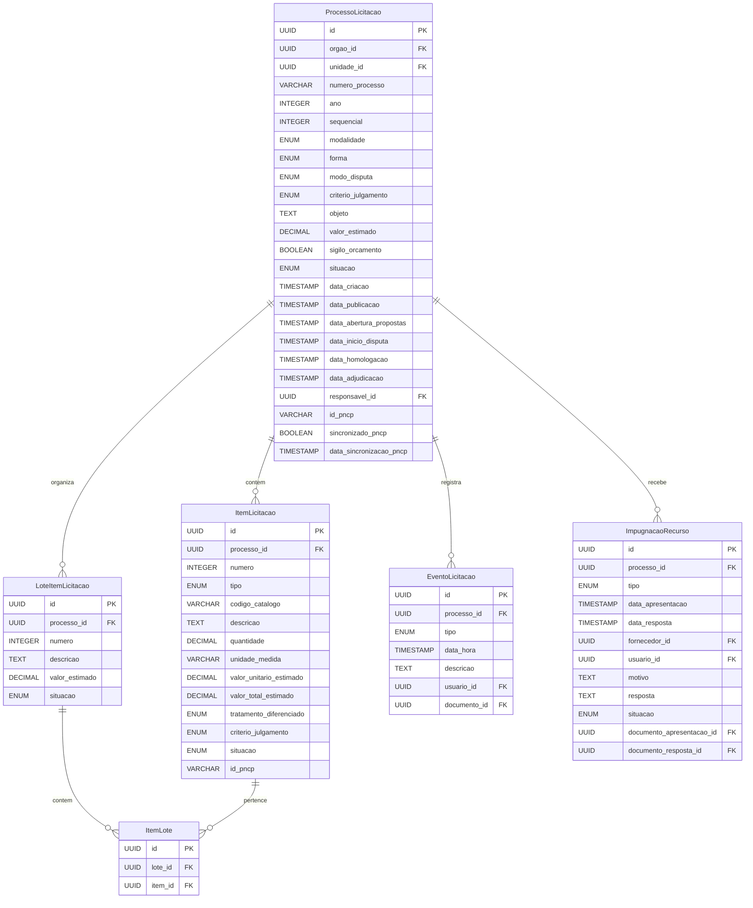
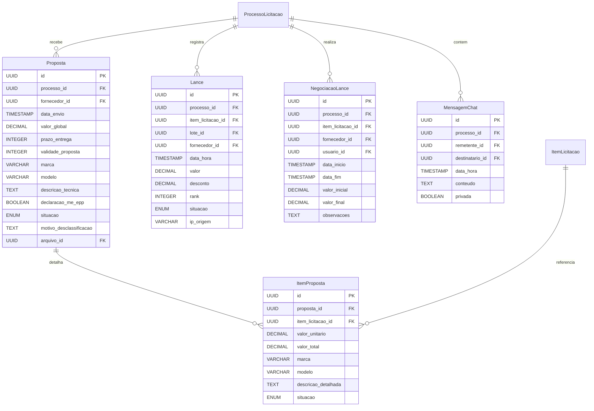
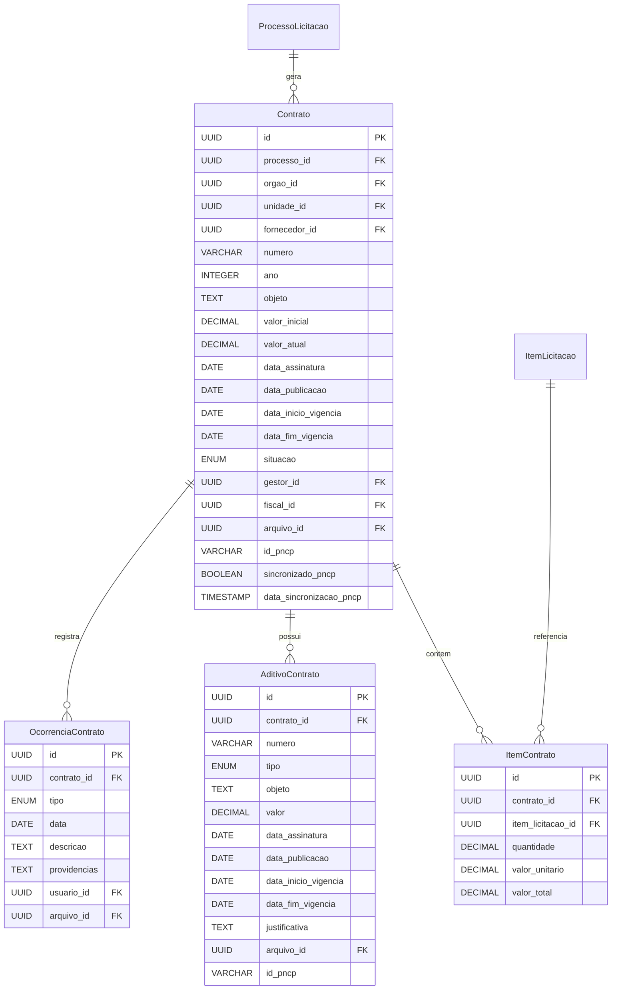

# Modelo de Dados do Portal de Licitação

## Sumário
1. [Introdução](#introdução)
2. [Visão Geral do Modelo de Dados](#visão-geral-do-modelo-de-dados)
3. [Entidades Principais](#entidades-principais)
   - [Usuários e Autenticação](#usuários-e-autenticação)
   - [Órgãos e Unidades](#órgãos-e-unidades)
   - [Fornecedores](#fornecedores)
   - [Processos de Licitação](#processos-de-licitação)
   - [Documentos](#documentos)
   - [Propostas e Lances](#propostas-e-lances)
   - [Contratos](#contratos)
   - [Atas de Registro de Preço](#atas-de-registro-de-preço)
   - [Plano de Contratações](#plano-de-contratações)
4. [Diagramas de Entidade-Relacionamento](#diagramas-de-entidade-relacionamento)
5. [Mapeamento para Integração com PNCP](#mapeamento-para-integração-com-pncp)
6. [Considerações sobre Implementação](#considerações-sobre-implementação)
7. [Conclusão](#conclusão)

## Introdução

Este documento apresenta o modelo de dados proposto para o portal de licitação destinado a câmaras de vereadores e prefeituras da região oeste da Bahia. O modelo foi desenvolvido considerando os requisitos legais da Lei nº 14.133/2021, as funcionalidades essenciais identificadas na análise de portais existentes e os requisitos técnicos para integração com o Portal Nacional de Contratações Públicas (PNCP).

O modelo de dados é um componente fundamental do sistema, pois define como as informações serão estruturadas, armazenadas e relacionadas. Um modelo bem projetado garante a integridade dos dados, facilita a implementação das funcionalidades e permite a evolução do sistema ao longo do tempo.

## Visão Geral do Modelo de Dados

O modelo de dados do portal de licitação é composto por diversas entidades que representam os principais conceitos do domínio de licitações públicas. As entidades estão organizadas em grupos funcionais, como usuários e autenticação, órgãos e unidades, processos de licitação, documentos, propostas, contratos, entre outros.

O modelo foi projetado seguindo os princípios de normalização de banco de dados, evitando redundâncias e garantindo a integridade referencial. Além disso, foram consideradas as necessidades de desempenho, flexibilidade e manutenibilidade do sistema.

A implementação do modelo será realizada utilizando o PostgreSQL como sistema de gerenciamento de banco de dados relacional, conforme definido na arquitetura do sistema. O Django ORM será utilizado para mapear as entidades do modelo para tabelas no banco de dados e para implementar as operações de CRUD (Create, Read, Update, Delete).

## Entidades Principais

### Usuários e Autenticação

#### Entidade: Usuario

Representa os usuários do sistema, incluindo servidores públicos, pregoeiros, fornecedores e administradores.

| Atributo | Tipo | Descrição |
|----------|------|-----------|
| id | UUID | Identificador único do usuário |
| nome | VARCHAR(255) | Nome completo do usuário |
| email | VARCHAR(255) | Email do usuário (único) |
| cpf | VARCHAR(14) | CPF do usuário (único) |
| telefone | VARCHAR(20) | Telefone de contato |
| cargo | VARCHAR(100) | Cargo ou função do usuário |
| data_cadastro | TIMESTAMP | Data e hora do cadastro |
| ultimo_acesso | TIMESTAMP | Data e hora do último acesso |
| ativo | BOOLEAN | Indica se o usuário está ativo |
| id_externo_govbr | VARCHAR(100) | Identificador do usuário no GOV.BR |
| token_govbr | TEXT | Token de autenticação do GOV.BR |
| token_expiracao | TIMESTAMP | Data e hora de expiração do token |

#### Entidade: Perfil

Representa os perfis de acesso disponíveis no sistema.

| Atributo | Tipo | Descrição |
|----------|------|-----------|
| id | UUID | Identificador único do perfil |
| nome | VARCHAR(100) | Nome do perfil |
| descricao | TEXT | Descrição das responsabilidades do perfil |

#### Entidade: UsuarioPerfil

Associação entre usuários e perfis, permitindo que um usuário tenha múltiplos perfis.

| Atributo | Tipo | Descrição |
|----------|------|-----------|
| id | UUID | Identificador único da associação |
| usuario_id | UUID | Referência ao usuário |
| perfil_id | UUID | Referência ao perfil |
| data_atribuicao | TIMESTAMP | Data e hora da atribuição do perfil |

#### Entidade: Permissao

Representa as permissões específicas no sistema.

| Atributo | Tipo | Descrição |
|----------|------|-----------|
| id | UUID | Identificador único da permissão |
| nome | VARCHAR(100) | Nome da permissão |
| codigo | VARCHAR(50) | Código da permissão (para uso interno) |
| descricao | TEXT | Descrição da permissão |

#### Entidade: PerfilPermissao

Associação entre perfis e permissões.

| Atributo | Tipo | Descrição |
|----------|------|-----------|
| id | UUID | Identificador único da associação |
| perfil_id | UUID | Referência ao perfil |
| permissao_id | UUID | Referência à permissão |

### Órgãos e Unidades

#### Entidade: Orgao

Representa os órgãos públicos que utilizam o sistema para realizar licitações.

| Atributo | Tipo | Descrição |
|----------|------|-----------|
| id | UUID | Identificador único do órgão |
| cnpj | VARCHAR(18) | CNPJ do órgão (único) |
| nome | VARCHAR(255) | Nome oficial do órgão |
| sigla | VARCHAR(20) | Sigla do órgão |
| esfera | ENUM | Esfera administrativa (Federal, Estadual, Municipal) |
| poder | ENUM | Poder (Executivo, Legislativo, Judiciário) |
| endereco | TEXT | Endereço completo |
| telefone | VARCHAR(20) | Telefone de contato |
| email | VARCHAR(255) | Email institucional |
| site | VARCHAR(255) | Site oficial |
| data_cadastro | TIMESTAMP | Data e hora do cadastro |
| ativo | BOOLEAN | Indica se o órgão está ativo |
| id_pncp | VARCHAR(100) | Identificador do órgão no PNCP |

#### Entidade: Unidade

Representa as unidades administrativas dentro de um órgão.

| Atributo | Tipo | Descrição |
|----------|------|-----------|
| id | UUID | Identificador único da unidade |
| orgao_id | UUID | Referência ao órgão |
| codigo | VARCHAR(50) | Código da unidade |
| nome | VARCHAR(255) | Nome da unidade |
| sigla | VARCHAR(20) | Sigla da unidade |
| responsavel | VARCHAR(255) | Nome do responsável pela unidade |
| endereco | TEXT | Endereço da unidade |
| telefone | VARCHAR(20) | Telefone de contato |
| email | VARCHAR(255) | Email institucional |
| data_cadastro | TIMESTAMP | Data e hora do cadastro |
| ativa | BOOLEAN | Indica se a unidade está ativa |
| id_pncp | VARCHAR(100) | Identificador da unidade no PNCP |

### Fornecedores

#### Entidade: Fornecedor

Representa as empresas ou pessoas físicas que participam de licitações.

| Atributo | Tipo | Descrição |
|----------|------|-----------|
| id | UUID | Identificador único do fornecedor |
| tipo | ENUM | Tipo de fornecedor (PF, PJ) |
| cpf_cnpj | VARCHAR(18) | CPF ou CNPJ do fornecedor (único) |
| nome_razao_social | VARCHAR(255) | Nome ou razão social |
| nome_fantasia | VARCHAR(255) | Nome fantasia (para PJ) |
| inscricao_estadual | VARCHAR(30) | Inscrição estadual (para PJ) |
| inscricao_municipal | VARCHAR(30) | Inscrição municipal (para PJ) |
| endereco | TEXT | Endereço completo |
| telefone | VARCHAR(20) | Telefone de contato |
| email | VARCHAR(255) | Email de contato |
| site | VARCHAR(255) | Site da empresa |
| data_cadastro | TIMESTAMP | Data e hora do cadastro |
| ativo | BOOLEAN | Indica se o fornecedor está ativo |
| porte | ENUM | Porte da empresa (ME, EPP, Médio, Grande) |
| optante_simples | BOOLEAN | Indica se é optante pelo Simples Nacional |

#### Entidade: RepresentanteFornecedor

Representa os representantes legais de um fornecedor.

| Atributo | Tipo | Descrição |
|----------|------|-----------|
| id | UUID | Identificador único do representante |
| fornecedor_id | UUID | Referência ao fornecedor |
| usuario_id | UUID | Referência ao usuário |
| nome | VARCHAR(255) | Nome do representante |
| cpf | VARCHAR(14) | CPF do representante |
| cargo | VARCHAR(100) | Cargo ou função na empresa |
| telefone | VARCHAR(20) | Telefone de contato |
| email | VARCHAR(255) | Email de contato |
| data_inicio | DATE | Data de início da representação |
| data_fim | DATE | Data de término da representação (se houver) |
| ativo | BOOLEAN | Indica se o representante está ativo |

#### Entidade: DocumentoFornecedor

Representa os documentos de habilitação de um fornecedor.

| Atributo | Tipo | Descrição |
|----------|------|-----------|
| id | UUID | Identificador único do documento |
| fornecedor_id | UUID | Referência ao fornecedor |
| tipo | ENUM | Tipo de documento (Contrato Social, Certidão Negativa, etc.) |
| numero | VARCHAR(100) | Número do documento |
| data_emissao | DATE | Data de emissão |
| data_validade | DATE | Data de validade |
| arquivo_id | UUID | Referência ao arquivo do documento |
| observacoes | TEXT | Observações sobre o documento |

### Processos de Licitação

#### Entidade: ProcessoLicitacao

Representa um processo de licitação completo.

| Atributo | Tipo | Descrição |
|----------|------|-----------|
| id | UUID | Identificador único do processo |
| orgao_id | UUID | Referência ao órgão |
| unidade_id | UUID | Referência à unidade |
| numero_processo | VARCHAR(50) | Número do processo administrativo |
| ano | INTEGER | Ano do processo |
| sequencial | INTEGER | Número sequencial do processo no ano |
| modalidade | ENUM | Modalidade de licitação (Pregão, Concorrência, etc.) |
| forma | ENUM | Forma de realização (Eletrônica, Presencial) |
| modo_disputa | ENUM | Modo de disputa (Aberto, Fechado, Aberto e Fechado) |
| criterio_julgamento | ENUM | Critério de julgamento (Menor Preço, Técnica e Preço, etc.) |
| objeto | TEXT | Descrição do objeto da licitação |
| valor_estimado | DECIMAL(15,2) | Valor estimado da contratação |
| sigilo_orcamento | BOOLEAN | Indica se o orçamento é sigiloso |
| situacao | ENUM | Situação atual do processo |
| data_criacao | TIMESTAMP | Data e hora de criação do processo |
| data_publicacao | TIMESTAMP | Data e hora de publicação do edital |
| data_abertura_propostas | TIMESTAMP | Data e hora de abertura das propostas |
| data_inicio_disputa | TIMESTAMP | Data e hora de início da disputa |
| data_homologacao | TIMESTAMP | Data e hora da homologação |
| data_adjudicacao | TIMESTAMP | Data e hora da adjudicação |
| responsavel_id | UUID | Referência ao usuário responsável |
| id_pncp | VARCHAR(100) | Identificador do processo no PNCP |
| sincronizado_pncp | BOOLEAN | Indica se foi sincronizado com o PNCP |
| data_sincronizacao_pncp | TIMESTAMP | Data e hora da última sincronização com o PNCP |

#### Entidade: ItemLicitacao

Representa um item específico dentro de um processo de licitação.

| Atributo | Tipo | Descrição |
|----------|------|-----------|
| id | UUID | Identificador único do item |
| processo_id | UUID | Referência ao processo de licitação |
| numero | INTEGER | Número do item no processo |
| tipo | ENUM | Tipo do item (Material, Serviço) |
| codigo_catalogo | VARCHAR(50) | Código do item no catálogo de materiais/serviços |
| descricao | TEXT | Descrição detalhada do item |
| quantidade | DECIMAL(15,3) | Quantidade do item |
| unidade_medida | VARCHAR(50) | Unidade de medida |
| valor_unitario_estimado | DECIMAL(15,4) | Valor unitário estimado |
| valor_total_estimado | DECIMAL(15,2) | Valor total estimado (quantidade * valor unitário) |
| tratamento_diferenciado | ENUM | Tratamento diferenciado (ME/EPP, Margem de Preferência, etc.) |
| criterio_julgamento | ENUM | Critério de julgamento específico do item |
| situacao | ENUM | Situação atual do item |
| id_pncp | VARCHAR(100) | Identificador do item no PNCP |

#### Entidade: LoteItemLicitacao

Representa um lote de itens em um processo de licitação.

| Atributo | Tipo | Descrição |
|----------|------|-----------|
| id | UUID | Identificador único do lote |
| processo_id | UUID | Referência ao processo de licitação |
| numero | INTEGER | Número do lote no processo |
| descricao | TEXT | Descrição do lote |
| valor_estimado | DECIMAL(15,2) | Valor estimado do lote |
| situacao | ENUM | Situação atual do lote |

#### Entidade: ItemLote

Associação entre itens e lotes.

| Atributo | Tipo | Descrição |
|----------|------|-----------|
| id | UUID | Identificador único da associação |
| lote_id | UUID | Referência ao lote |
| item_id | UUID | Referência ao item |

#### Entidade: EventoLicitacao

Representa eventos ocorridos durante o processo de licitação.

| Atributo | Tipo | Descrição |
|----------|------|-----------|
| id | UUID | Identificador único do evento |
| processo_id | UUID | Referência ao processo de licitação |
| tipo | ENUM | Tipo de evento (Publicação, Impugnação, Esclarecimento, etc.) |
| data_hora | TIMESTAMP | Data e hora do evento |
| descricao | TEXT | Descrição do evento |
| usuario_id | UUID | Referência ao usuário que registrou o evento |
| documento_id | UUID | Referência ao documento relacionado (se houver) |

#### Entidade: ImpugnacaoRecurso

Representa impugnações, recursos e pedidos de esclarecimento.

| Atributo | Tipo | Descrição |
|----------|------|-----------|
| id | UUID | Identificador único |
| processo_id | UUID | Referência ao processo de licitação |
| tipo | ENUM | Tipo (Impugnação, Recurso, Esclarecimento) |
| data_apresentacao | TIMESTAMP | Data e hora da apresentação |
| data_resposta | TIMESTAMP | Data e hora da resposta |
| fornecedor_id | UUID | Referência ao fornecedor (se aplicável) |
| usuario_id | UUID | Referência ao usuário que apresentou |
| motivo | TEXT | Motivo ou justificativa |
| resposta | TEXT | Resposta da administração |
| situacao | ENUM | Situação (Pendente, Deferido, Indeferido) |
| documento_apresentacao_id | UUID | Referência ao documento de apresentação |
| documento_resposta_id | UUID | Referência ao documento de resposta |

### Documentos

#### Entidade: Documento

Representa documentos relacionados aos processos de licitação.

| Atributo | Tipo | Descrição |
|----------|------|-----------|
| id | UUID | Identificador único do documento |
| processo_id | UUID | Referência ao processo de licitação |
| tipo | ENUM | Tipo de documento (Edital, Termo de Referência, Ata, etc.) |
| titulo | VARCHAR(255) | Título do documento |
| descricao | TEXT | Descrição do documento |
| data_criacao | TIMESTAMP | Data e hora de criação |
| data_publicacao | TIMESTAMP | Data e hora de publicação |
| versao | VARCHAR(20) | Versão do documento |
| situacao | ENUM | Situação do documento |
| usuario_id | UUID | Referência ao usuário que criou o documento |
| arquivo_id | UUID | Referência ao arquivo do documento |
| id_pncp | VARCHAR(100) | Identificador do documento no PNCP |

#### Entidade: Arquivo

Representa arquivos físicos armazenados no sistema.

| Atributo | Tipo | Descrição |
|----------|------|-----------|
| id | UUID | Identificador único do arquivo |
| nome_original | VARCHAR(255) | Nome original do arquivo |
| nome_armazenamento | VARCHAR(255) | Nome de armazenamento (gerado pelo sistema) |
| caminho | VARCHAR(255) | Caminho de armazenamento |
| tipo_mime | VARCHAR(100) | Tipo MIME do arquivo |
| tamanho | BIGINT | Tamanho em bytes |
| hash_md5 | VARCHAR(32) | Hash MD5 para verificação de integridade |
| data_upload | TIMESTAMP | Data e hora do upload |
| usuario_id | UUID | Referência ao usuário que fez o upload |

### Propostas e Lances

#### Entidade: Proposta

Representa propostas enviadas pelos fornecedores.

| Atributo | Tipo | Descrição |
|----------|------|-----------|
| id | UUID | Identificador único da proposta |
| processo_id | UUID | Referência ao processo de licitação |
| fornecedor_id | UUID | Referência ao fornecedor |
| data_envio | TIMESTAMP | Data e hora do envio |
| valor_global | DECIMAL(15,2) | Valor global da proposta |
| prazo_entrega | INTEGER | Prazo de entrega em dias |
| validade_proposta | INTEGER | Validade da proposta em dias |
| marca | VARCHAR(100) | Marca do produto (se aplicável) |
| modelo | VARCHAR(100) | Modelo do produto (se aplicável) |
| descricao_tecnica | TEXT | Descrição técnica da proposta |
| declaracao_me_epp | BOOLEAN | Declaração de ME/EPP |
| situacao | ENUM | Situação da proposta |
| motivo_desclassificacao | TEXT | Motivo de desclassificação (se aplicável) |
| arquivo_id | UUID | Referência ao arquivo da proposta |

#### Entidade: ItemProposta

Representa itens específicos de uma proposta.

| Atributo | Tipo | Descrição |
|----------|------|-----------|
| id | UUID | Identificador único do item da proposta |
| proposta_id | UUID | Referência à proposta |
| item_licitacao_id | UUID | Referência ao item da licitação |
| valor_unitario | DECIMAL(15,4) | Valor unitário proposto |
| valor_total | DECIMAL(15,2) | Valor total proposto |
| marca | VARCHAR(100) | Marca do produto |
| modelo | VARCHAR(100) | Modelo do produto |
| descricao_detalhada | TEXT | Descrição detalhada do item |
| situacao | ENUM | Situação do item da proposta |

#### Entidade: Lance

Representa lances dados durante a fase de disputa.

| Atributo | Tipo | Descrição |
|----------|------|-----------|
| id | UUID | Identificador único do lance |
| processo_id | UUID | Referência ao processo de licitação |
| item_licitacao_id | UUID | Referência ao item da licitação |
| lote_id | UUID | Referência ao lote (se aplicável) |
| fornecedor_id | UUID | Referência ao fornecedor |
| data_hora | TIMESTAMP | Data e hora do lance |
| valor | DECIMAL(15,4) | Valor do lance |
| desconto | DECIMAL(5,2) | Percentual de desconto (se aplicável) |
| rank | INTEGER | Classificação do lance |
| situacao | ENUM | Situação do lance |
| ip_origem | VARCHAR(45) | IP de origem do lance |

#### Entidade: NegociacaoLance

Representa negociações após a fase de lances.

| Atributo | Tipo | Descrição |
|----------|------|-----------|
| id | UUID | Identificador único da negociação |
| processo_id | UUID | Referência ao processo de licitação |
| item_licitacao_id | UUID | Referência ao item da licitação |
| fornecedor_id | UUID | Referência ao fornecedor |
| usuario_id | UUID | Referência ao usuário (pregoeiro) |
| data_inicio | TIMESTAMP | Data e hora de início da negociação |
| data_fim | TIMESTAMP | Data e hora de fim da negociação |
| valor_inicial | DECIMAL(15,4) | Valor inicial da negociação |
| valor_final | DECIMAL(15,4) | Valor final negociado |
| observacoes | TEXT | Observações sobre a negociação |

#### Entidade: MensagemChat

Representa mensagens trocadas no chat durante a sessão pública.

| Atributo | Tipo | Descrição |
|----------|------|-----------|
| id | UUID | Identificador único da mensagem |
| processo_id | UUID | Referência ao processo de licitação |
| remetente_id | UUID | Referência ao usuário remetente |
| destinatario_id | UUID | Referência ao usuário destinatário (se privada) |
| data_hora | TIMESTAMP | Data e hora da mensagem |
| conteudo | TEXT | Conteúdo da mensagem |
| privada | BOOLEAN | Indica se é uma mensagem privada |

### Contratos

#### Entidade: Contrato

Representa contratos resultantes de processos de licitação.

| Atributo | Tipo | Descrição |
|----------|------|-----------|
| id | UUID | Identificador único do contrato |
| processo_id | UUID | Referência ao processo de licitação |
| orgao_id | UUID | Referência ao órgão |
| unidade_id | UUID | Referência à unidade |
| fornecedor_id | UUID | Referência ao fornecedor |
| numero | VARCHAR(50) | Número do contrato |
| ano | INTEGER | Ano do contrato |
| objeto | TEXT | Objeto do contrato |
| valor_inicial | DECIMAL(15,2) | Valor inicial do contrato |
| valor_atual | DECIMAL(15,2) | Valor atual do contrato (após aditivos) |
| data_assinatura | DATE | Data de assinatura |
| data_publicacao | DATE | Data de publicação |
| data_inicio_vigencia | DATE | Data de início da vigência |
| data_fim_vigencia | DATE | Data de fim da vigência |
| situacao | ENUM | Situação do contrato |
| gestor_id | UUID | Referência ao usuário gestor do contrato |
| fiscal_id | UUID | Referência ao usuário fiscal do contrato |
| arquivo_id | UUID | Referência ao arquivo do contrato |
| id_pncp | VARCHAR(100) | Identificador do contrato no PNCP |
| sincronizado_pncp | BOOLEAN | Indica se foi sincronizado com o PNCP |
| data_sincronizacao_pncp | TIMESTAMP | Data e hora da última sincronização com o PNCP |

#### Entidade: ItemContrato

Representa itens específicos de um contrato.

| Atributo | Tipo | Descrição |
|----------|------|-----------|
| id | UUID | Identificador único do item do contrato |
| contrato_id | UUID | Referência ao contrato |
| item_licitacao_id | UUID | Referência ao item da licitação |
| quantidade | DECIMAL(15,3) | Quantidade contratada |
| valor_unitario | DECIMAL(15,4) | Valor unitário contratado |
| valor_total | DECIMAL(15,2) | Valor total do item |

#### Entidade: AditivoContrato

Representa aditivos a contratos existentes.

| Atributo | Tipo | Descrição |
|----------|------|-----------|
| id | UUID | Identificador único do aditivo |
| contrato_id | UUID | Referência ao contrato |
| numero | VARCHAR(50) | Número do aditivo |
| tipo | ENUM | Tipo de aditivo (Prazo, Valor, Objeto) |
| objeto | TEXT | Objeto do aditivo |
| valor | DECIMAL(15,2) | Valor do aditivo (se aplicável) |
| data_assinatura | DATE | Data de assinatura |
| data_publicacao | DATE | Data de publicação |
| data_inicio_vigencia | DATE | Data de início da vigência |
| data_fim_vigencia | DATE | Data de fim da vigência |
| justificativa | TEXT | Justificativa para o aditivo |
| arquivo_id | UUID | Referência ao arquivo do aditivo |
| id_pncp | VARCHAR(100) | Identificador do aditivo no PNCP |

#### Entidade: OcorrenciaContrato

Representa ocorrências durante a execução do contrato.

| Atributo | Tipo | Descrição |
|----------|------|-----------|
| id | UUID | Identificador único da ocorrência |
| contrato_id | UUID | Referência ao contrato |
| tipo | ENUM | Tipo de ocorrência |
| data | DATE | Data da ocorrência |
| descricao | TEXT | Descrição da ocorrência |
| providencias | TEXT | Providências tomadas |
| usuario_id | UUID | Referência ao usuário que registrou |
| arquivo_id | UUID | Referência ao arquivo relacionado |

### Atas de Registro de Preço

#### Entidade: AtaRegistroPreco

Representa atas de registro de preço resultantes de licitações.

| Atributo | Tipo | Descrição |
|----------|------|-----------|
| id | UUID | Identificador único da ata |
| processo_id | UUID | Referência ao processo de licitação |
| orgao_id | UUID | Referência ao órgão gerenciador |
| numero | VARCHAR(50) | Número da ata |
| ano | INTEGER | Ano da ata |
| objeto | TEXT | Objeto da ata |
| valor_total | DECIMAL(15,2) | Valor total da ata |
| data_assinatura | DATE | Data de assinatura |
| data_publicacao | DATE | Data de publicação |
| data_inicio_vigencia | DATE | Data de início da vigência |
| data_fim_vigencia | DATE | Data de fim da vigência |
| situacao | ENUM | Situação da ata |
| arquivo_id | UUID | Referência ao arquivo da ata |
| id_pncp | VARCHAR(100) | Identificador da ata no PNCP |
| sincronizado_pncp | BOOLEAN | Indica se foi sincronizado com o PNCP |
| data_sincronizacao_pncp | TIMESTAMP | Data e hora da última sincronização com o PNCP |

#### Entidade: ItemAtaRegistroPreco

Representa itens específicos de uma ata de registro de preço.

| Atributo | Tipo | Descrição |
|----------|------|-----------|
| id | UUID | Identificador único do item da ata |
| ata_id | UUID | Referência à ata |
| item_licitacao_id | UUID | Referência ao item da licitação |
| fornecedor_id | UUID | Referência ao fornecedor |
| quantidade | DECIMAL(15,3) | Quantidade registrada |
| valor_unitario | DECIMAL(15,4) | Valor unitário registrado |
| valor_total | DECIMAL(15,2) | Valor total do item |
| marca | VARCHAR(100) | Marca do produto |
| modelo | VARCHAR(100) | Modelo do produto |

#### Entidade: OrgaoParticipante

Representa órgãos participantes de uma ata de registro de preço.

| Atributo | Tipo | Descrição |
|----------|------|-----------|
| id | UUID | Identificador único da participação |
| ata_id | UUID | Referência à ata |
| orgao_id | UUID | Referência ao órgão participante |
| data_adesao | DATE | Data de adesão |

#### Entidade: ItemOrgaoParticipante

Representa itens específicos para cada órgão participante.

| Atributo | Tipo | Descrição |
|----------|------|-----------|
| id | UUID | Identificador único |
| orgao_participante_id | UUID | Referência ao órgão participante |
| item_ata_id | UUID | Referência ao item da ata |
| quantidade | DECIMAL(15,3) | Quantidade para o órgão |
| valor_total | DECIMAL(15,2) | Valor total para o órgão |

### Plano de Contratações

#### Entidade: PlanoContratacaoAnual

Representa o plano anual de contratações de um órgão.

| Atributo | Tipo | Descrição |
|----------|------|-----------|
| id | UUID | Identificador único do plano |
| orgao_id | UUID | Referência ao órgão |
| ano | INTEGER | Ano do plano |
| situacao | ENUM | Situação do plano |
| data_criacao | TIMESTAMP | Data e hora de criação |
| data_publicacao | TIMESTAMP | Data e hora de publicação |
| responsavel_id | UUID | Referência ao usuário responsável |
| arquivo_id | UUID | Referência ao arquivo do plano |
| id_pncp | VARCHAR(100) | Identificador do plano no PNCP |
| sincronizado_pncp | BOOLEAN | Indica se foi sincronizado com o PNCP |
| data_sincronizacao_pncp | TIMESTAMP | Data e hora da última sincronização com o PNCP |

#### Entidade: ItemPlanoContratacao

Representa itens específicos do plano de contratação.

| Atributo | Tipo | Descrição |
|----------|------|-----------|
| id | UUID | Identificador único do item do plano |
| plano_id | UUID | Referência ao plano |
| unidade_id | UUID | Referência à unidade requisitante |
| tipo | ENUM | Tipo do item (Material, Serviço) |
| codigo_catalogo | VARCHAR(50) | Código do item no catálogo |
| descricao | TEXT | Descrição do item |
| quantidade | DECIMAL(15,3) | Quantidade planejada |
| unidade_medida | VARCHAR(50) | Unidade de medida |
| valor_unitario_estimado | DECIMAL(15,4) | Valor unitário estimado |
| valor_total_estimado | DECIMAL(15,2) | Valor total estimado |
| mes_previsto | INTEGER | Mês previsto para a contratação (1-12) |
| justificativa | TEXT | Justificativa da contratação |
| prioridade | ENUM | Prioridade (Alta, Média, Baixa) |
| situacao | ENUM | Situação do item |
| processo_id | UUID | Referência ao processo de licitação (quando executado) |

## Diagramas de Entidade-Relacionamento

### Diagrama ER - Visão Geral



### Diagrama ER - Usuários e Autenticação



### Diagrama ER - Processos de Licitação



### Diagrama ER - Propostas e Lances



### Diagrama ER - Contratos



## Mapeamento para Integração com PNCP

Para garantir a integração eficiente com o Portal Nacional de Contratações Públicas (PNCP), é necessário mapear as entidades do modelo de dados para as estruturas de dados esperadas pela API do PNCP. A tabela abaixo apresenta esse mapeamento:

| Entidade no Modelo | Endpoint PNCP | Campos Principais para Integração |
|-------------------|---------------|-----------------------------------|
| Orgao | /v1/orgaos | cnpj, nome, id_pncp |
| Unidade | /v1/orgaos/{cnpj}/unidades | codigo, nome, id_pncp |
| ProcessoLicitacao | /v1/orgaos/{cnpj}/compras | ano, sequencial, modalidade, objeto, id_pncp |
| ItemLicitacao | /v1/orgaos/{cnpj}/compras/{ano}/{sequencial}/itens | numero, descricao, quantidade, valor_unitario_estimado, id_pncp |
| Documento | /v1/orgaos/{cnpj}/compras/{ano}/{sequencial}/arquivos | tipo, titulo, arquivo_id, id_pncp |
| ItemProposta (resultado) | /v1/orgaos/{cnpj}/compras/{ano}/{sequencial}/itens/{numero}/resultados | valor_unitario, fornecedor_id |
| Contrato | /v1/contratos | numero, ano, objeto, valor_inicial, data_assinatura, id_pncp |
| AditivoContrato | Relacionado aos endpoints de contratos | numero, tipo, valor, data_assinatura, id_pncp |
| AtaRegistroPreco | /v1/atas | numero, ano, objeto, data_assinatura, id_pncp |
| PlanoContratacaoAnual | /v1/pca | ano, orgao_id, id_pncp |

Para cada entidade que precisa ser sincronizada com o PNCP, foram adicionados campos específicos:
- `id_pncp`: Identificador da entidade no PNCP
- `sincronizado_pncp`: Flag que indica se a entidade foi sincronizada
- `data_sincronizacao_pncp`: Data e hora da última sincronização

O módulo de integração com o PNCP será responsável por:
1. Mapear os dados do modelo interno para o formato esperado pela API do PNCP
2. Enviar os dados para o PNCP através dos endpoints apropriados
3. Receber e processar as respostas da API
4. Atualizar os campos de sincronização no modelo de dados
5. Registrar logs detalhados de todas as operações

## Considerações sobre Implementação

### Uso do Django ORM

O modelo de dados será implementado utilizando o Django ORM (Object-Relational Mapping), que oferece uma camada de abstração para interação com o banco de dados PostgreSQL. Cada entidade do modelo será representada por uma classe de modelo Django, com os atributos mapeados para campos do banco de dados.

Exemplo de implementação da entidade `ProcessoLicitacao`:

```python
import uuid
from django.db import models
from django.utils import timezone

class ProcessoLicitacao(models.Model):
    MODALIDADE_CHOICES = [
        ('PREGAO', 'Pregão'),
        ('CONCORRENCIA', 'Concorrência'),
        ('CONCURSO', 'Concurso'),
        ('LEILAO', 'Leilão'),
        ('DIALOGO_COMPETITIVO', 'Diálogo Competitivo'),
    ]
    
    FORMA_CHOICES = [
        ('ELETRONICA', 'Eletrônica'),
        ('PRESENCIAL', 'Presencial'),
    ]
    
    SITUACAO_CHOICES = [
        ('RASCUNHO', 'Rascunho'),
        ('PUBLICADO', 'Publicado'),
        ('EM_ANDAMENTO', 'Em Andamento'),
        ('SUSPENSO', 'Suspenso'),
        ('HOMOLOGADO', 'Homologado'),
        ('REVOGADO', 'Revogado'),
        ('ANULADO', 'Anulado'),
        ('FRACASSADO', 'Fracassado'),
        ('DESERTO', 'Deserto'),
    ]
    
    id = models.UUIDField(primary_key=True, default=uuid.uuid4, editable=False)
    orgao = models.ForeignKey('Orgao', on_delete=models.PROTECT, related_name='processos')
    unidade = models.ForeignKey('Unidade', on_delete=models.PROTECT, related_name='processos')
    numero_processo = models.CharField(max_length=50)
    ano = models.IntegerField()
    sequencial = models.IntegerField()
    modalidade = models.CharField(max_length=20, choices=MODALIDADE_CHOICES)
    forma = models.CharField(max_length=20, choices=FORMA_CHOICES)
    modo_disputa = models.CharField(max_length=20)
    criterio_julgamento = models.CharField(max_length=50)
    objeto = models.TextField()
    valor_estimado = models.DecimalField(max_digits=15, decimal_places=2)
    sigilo_orcamento = models.BooleanField(default=False)
    situacao = models.CharField(max_length=20, choices=SITUACAO_CHOICES)
    data_criacao = models.DateTimeField(default=timezone.now)
    data_publicacao = models.DateTimeField(null=True, blank=True)
    data_abertura_propostas = models.DateTimeField(null=True, blank=True)
    data_inicio_disputa = models.DateTimeField(null=True, blank=True)
    data_homologacao = models.DateTimeField(null=True, blank=True)
    data_adjudicacao = models.DateTimeField(null=True, blank=True)
    responsavel = models.ForeignKey('Usuario', on_delete=models.PROTECT, related_name='processos_responsavel')
    id_pncp = models.CharField(max_length=100, null=True, blank=True)
    sincronizado_pncp = models.BooleanField(default=False)
    data_sincronizacao_pncp = models.DateTimeField(null=True, blank=True)
    
    class Meta:
        unique_together = ('orgao', 'ano', 'sequencial')
        indexes = [
            models.Index(fields=['orgao', 'ano', 'sequencial']),
            models.Index(fields=['situacao']),
            models.Index(fields=['data_publicacao']),
        ]
    
    def __str__(self):
        return f"{self.orgao.sigla} - {self.numero_processo} ({self.ano}/{self.sequencial})"
```

### Índices e Otimização

Para garantir o desempenho adequado do sistema, serão criados índices para os campos mais utilizados em consultas:

1. Chaves primárias (UUIDs)
2. Chaves estrangeiras
3. Campos de busca frequente (número de processo, CNPJ, CPF, etc.)
4. Campos de filtro (situação, data, etc.)
5. Campos de ordenação (data, valor, etc.)

### Transações e Integridade

O Django ORM oferece suporte a transações, que serão utilizadas para garantir a integridade dos dados em operações que envolvem múltiplas entidades. Por exemplo, ao criar um processo de licitação com seus itens, todos os registros serão criados em uma única transação.

### Auditoria e Histórico

Para atender aos requisitos de auditoria e transparência, será implementado um sistema de registro de alterações (audit trail) utilizando o pacote `django-simple-history` ou similar. Isso permitirá rastrear todas as alterações realizadas nas entidades principais do sistema.

## Conclusão

O modelo de dados proposto para o portal de licitação atende aos requisitos legais da Lei nº 14.133/2021, às funcionalidades essenciais identificadas na análise de portais existentes e aos requisitos técnicos para integração com o PNCP. O modelo é abrangente, cobrindo todas as modalidades de licitação previstas na lei, e flexível o suficiente para acomodar futuras evoluções do sistema.

A implementação do modelo utilizando Django ORM e PostgreSQL oferece um bom equilíbrio entre robustez, desempenho e facilidade de desenvolvimento, alinhando-se à arquitetura e stack tecnológico definidos para o projeto.

Recomenda-se que a implementação do modelo seja realizada de forma incremental, priorizando as entidades essenciais para o funcionamento básico do sistema (usuários, órgãos, processos de licitação, itens, documentos) e expandindo gradualmente para incluir as funcionalidades mais avançadas (contratos, atas, planos de contratação).

A integração com o PNCP deve ser considerada desde o início do desenvolvimento, garantindo que todas as entidades relevantes incluam os campos necessários para a sincronização com o portal nacional.

Com este modelo de dados bem estruturado, o portal de licitação terá uma base sólida para atender às necessidades das câmaras de vereadores e prefeituras da região oeste da Bahia, garantindo conformidade legal, transparência e eficiência nos processos de contratação pública.
