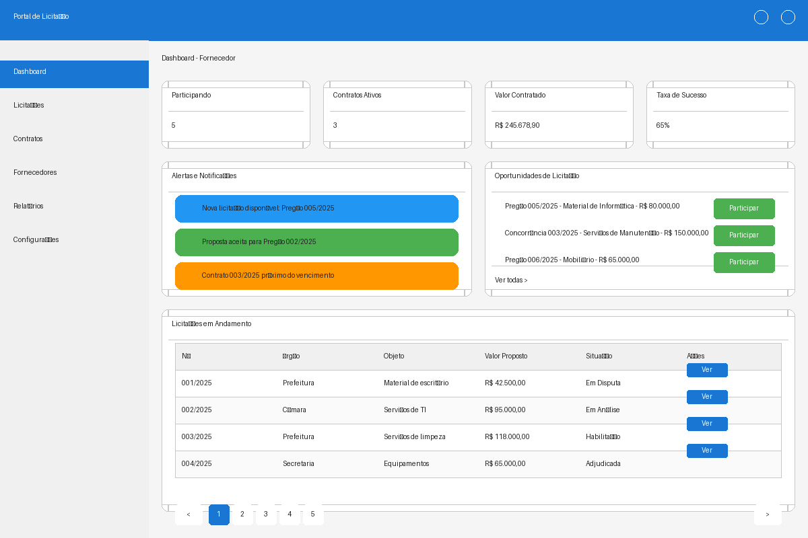

# Protótipos de Interface do Portal de Licitação

Este documento apresenta os protótipos de interface (wireframes) para as principais funcionalidades do portal de licitação, considerando os diferentes perfis de usuário (órgãos públicos e fornecedores) e os fluxos de trabalho definidos nos requisitos funcionais.

## Página Inicial

A página inicial do portal é a porta de entrada para todos os usuários, apresentando:

- Banner principal com informações sobre o portal e seus objetivos
- Botões de acesso ao sistema e cadastro para novos usuários
- Cards informativos destacando licitações abertas, contratos vigentes e transparência
- Design limpo e intuitivo que facilita a navegação para todos os tipos de usuários
- Acesso rápido às principais funcionalidades do sistema

## Login/Cadastro

A tela de login/cadastro permite o acesso ao sistema e o registro de novos usuários:

- Interface com abas para alternar entre login e cadastro
- Campos para entrada de credenciais (email e senha)
- Opção de "Lembrar-me" para maior comodidade
- Link para recuperação de senha
- Integração com GOV.BR para autenticação segura
- Layout responsivo e acessível, seguindo padrões de usabilidade

## Dashboard para Órgãos Públicos

O painel de controle para órgãos públicos oferece uma visão geral das atividades de licitação:

- Cards de resumo com indicadores-chave (licitações ativas, contratos vigentes, valores)
- Gráficos visuais mostrando distribuição de licitações por modalidade e situação
- Tabela de licitações recentes com ações rápidas
- Menu lateral para navegação entre as diferentes seções do sistema
- Informações organizadas de forma a facilitar o monitoramento e tomada de decisões

## Dashboard para Fornecedores

O painel de controle para fornecedores apresenta informações relevantes para participação em licitações:

- Cards de resumo com indicadores de desempenho (participações, contratos, valores)
- Seção de alertas e notificações para manter o fornecedor informado
- Lista de oportunidades de licitação com ações rápidas para participação
- Tabela de licitações em andamento com status atual
- Interface intuitiva que facilita o acompanhamento de processos e identificação de novas oportunidades

## Cadastro de Licitação

A tela de cadastro de licitação permite aos órgãos públicos criar novos processos licitatórios:

- Formulário organizado em abas para diferentes etapas do cadastro (dados básicos, itens, documentos, etc.)
- Campos para todas as informações essenciais (órgão, modalidade, objeto, valores)
- Seleção de opções conforme a Lei nº 14.133/2021
- Botões de ação para salvar rascunho ou avançar no processo
- Layout estruturado que guia o usuário através do processo de cadastro

## Envio de Propostas

A tela de envio de propostas permite aos fornecedores participar de licitações:

- Cabeçalho com informações da licitação para contextualização
- Formulário organizado em abas (proposta, itens, documentos, revisão)
- Tabela para preenchimento de valores por item
- Resumo da proposta com valor total e condições
- Declarações necessárias conforme legislação
- Interface que facilita o preenchimento correto e completo da proposta

## Sessão de Lances

A tela de sessão de lances permite a participação em tempo real na fase competitiva:

- Divisão em duas colunas: lances e chat da sessão
- Informações sobre o item em disputa e tempo restante
- Tabela com histórico de lances e classificação atual
- Formulário para envio de novos lances
- Chat para comunicação entre pregoeiro e participantes
- Design que prioriza a clareza e rapidez na interação durante a disputa

## Habilitação e Julgamento

A tela de habilitação e julgamento permite ao pregoeiro analisar documentos e decidir sobre a habilitação:

- Informações do fornecedor em análise
- Tabela de documentos com status, validade e observações
- Área para decisão do pregoeiro (habilitar/inabilitar)
- Campo para justificativa da decisão
- Botões para ações como solicitar documentos complementares
- Interface que facilita a análise sistemática dos documentos de habilitação

## Gestão de Contratos

A tela de gestão de contratos permite o acompanhamento e administração dos contratos:

- Barra de pesquisa e filtros para localização rápida
- Abas para diferentes situações de contratos (vigentes, encerrados, etc.)
- Tabela com informações essenciais dos contratos
- Botões de ação para visualizar e editar contratos
- Paginação para navegação entre múltiplos registros
- Layout que facilita o gerenciamento eficiente de múltiplos contratos

## Considerações sobre Usabilidade e Acessibilidade

Os protótipos foram desenvolvidos considerando as seguintes diretrizes de usabilidade e acessibilidade:

1. **Consistência visual**: Padrões de cores, tipografia e elementos de interface consistentes em todas as telas.

2. **Hierarquia de informação**: Organização das informações por relevância, facilitando a compreensão e navegação.

3. **Feedback visual**: Elementos interativos (botões, links) com estados visuais claros para indicar ações possíveis.

4. **Navegação intuitiva**: Menu lateral consistente e breadcrumbs para orientação do usuário.

5. **Responsividade**: Design adaptável a diferentes tamanhos de tela, priorizando a experiência mobile.

6. **Acessibilidade**: Contraste adequado entre texto e fundo, tamanhos de fonte legíveis, e estrutura semântica.

7. **Eficiência**: Atalhos e caminhos rápidos para ações frequentes, reduzindo o número de cliques necessários.

8. **Prevenção de erros**: Validação de campos e mensagens de confirmação para ações críticas.

Estes protótipos servirão como base para o desenvolvimento das interfaces finais do portal de licitação, garantindo uma experiência de usuário intuitiva, eficiente e acessível para todos os perfis de usuário.
