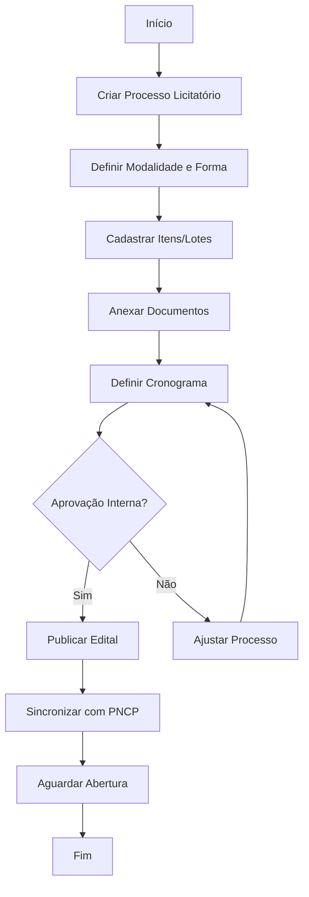
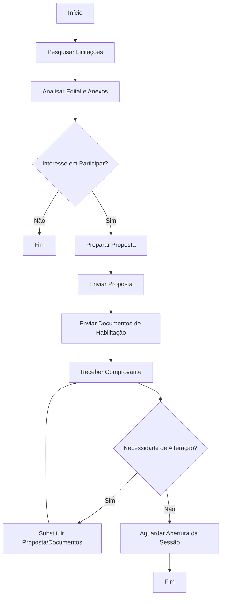
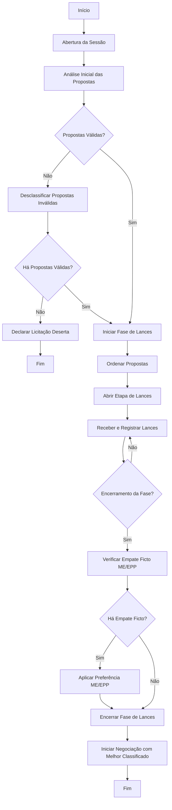
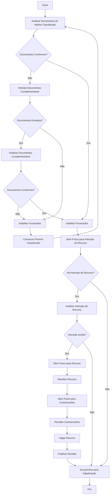
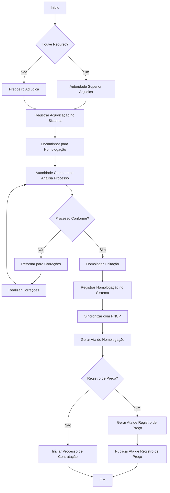
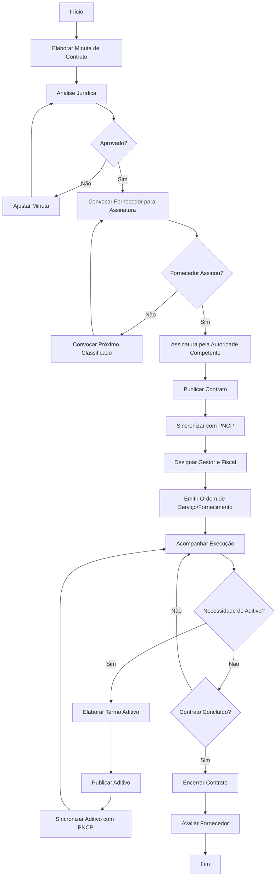
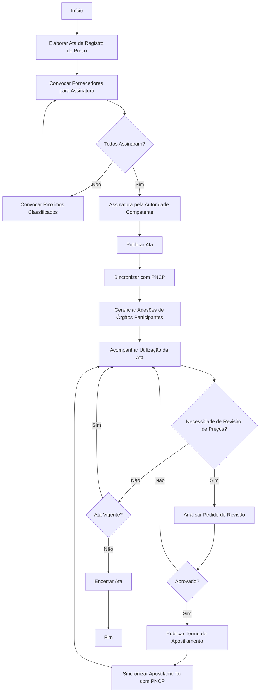
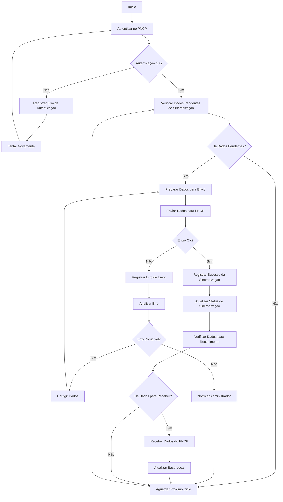

# Requisitos Funcionais Detalhados do Portal de Licitação

## Sumário
1. [Introdução](#introdução)
2. [Visão Geral do Sistema](#visão-geral-do-sistema)
3. [Perfis de Usuário](#perfis-de-usuário)
4. [Requisitos Funcionais por Perfil](#requisitos-funcionais-por-perfil)
   - [Administrador do Sistema](#administrador-do-sistema)
   - [Administrador do Órgão](#administrador-do-órgão)
   - [Pregoeiro/Comissão de Licitação](#pregoeiro-comissão-de-licitação)
   - [Gestor/Fiscal de Contratos](#gestor-fiscal-de-contratos)
   - [Fornecedor](#fornecedor)
   - [Usuário Público](#usuário-público)
5. [Fluxos de Trabalho Principais](#fluxos-de-trabalho-principais)
   - [Cadastro e Publicação de Licitação](#cadastro-e-publicação-de-licitação)
   - [Envio de Propostas e Documentos](#envio-de-propostas-e-documentos)
   - [Sessão Pública de Lances](#sessão-pública-de-lances)
   - [Habilitação e Julgamento](#habilitação-e-julgamento)
   - [Adjudicação e Homologação](#adjudicação-e-homologação)
   - [Gestão de Contratos](#gestão-de-contratos)
   - [Gestão de Atas de Registro de Preço](#gestão-de-atas-de-registro-de-preço)
   - [Integração com PNCP](#integração-com-pncp)
6. [Requisitos de Interface](#requisitos-de-interface)
7. [Requisitos de Notificação](#requisitos-de-notificação)
8. [Requisitos de Relatórios](#requisitos-de-relatórios)
9. [Requisitos de Auditoria e Logs](#requisitos-de-auditoria-e-logs)
10. [Considerações de Implementação](#considerações-de-implementação)

## Introdução

Este documento apresenta os requisitos funcionais detalhados para o portal de licitação destinado a câmaras de vereadores e prefeituras da região oeste da Bahia. Os requisitos foram elaborados com base na Lei nº 14.133/2021 (Nova Lei de Licitações e Contratos Administrativos), na análise de portais existentes, nos requisitos de integração com o Portal Nacional de Contratações Públicas (PNCP) e na arquitetura e modelo de dados definidos para o sistema.

O objetivo é detalhar como os usuários irão interagir com o sistema, quais ações poderão realizar e quais informações serão exibidas, fornecendo uma base sólida para o desenvolvimento do portal.

## Visão Geral do Sistema

O portal de licitação será uma plataforma web completa para gerenciamento de processos licitatórios, desde o planejamento até a execução contratual, atendendo a todas as modalidades previstas na Lei nº 14.133/2021. O sistema será desenvolvido utilizando Python com Django REST Framework para o backend, React com Next.js para o frontend, e PostgreSQL como banco de dados.

As principais funcionalidades do sistema incluem:

1. **Gestão de Usuários e Perfis**: Cadastro e gerenciamento de usuários com diferentes níveis de acesso, integração com GOV.BR para autenticação.

2. **Planejamento de Contratações**: Elaboração e gestão de Estudos Técnicos Preliminares (ETP), Termos de Referência e Plano Anual de Contratações.

3. **Gestão de Processos Licitatórios**: Criação e publicação de editais para diferentes modalidades de licitação, gerenciamento de cronogramas e prazos, registro e controle de impugnações e pedidos de esclarecimento.

4. **Condução de Sessões Públicas**: Abertura e condução de sessões públicas eletrônicas, análise de propostas e documentos de habilitação, registro de lances e negociações.

5. **Gestão de Contratos**: Elaboração e registro de contratos, controle de vigência e valores, gestão de aditivos e apostilamentos, registro de ocorrências na execução contratual.

6. **Integração com PNCP**: Sincronização automática de dados com o Portal Nacional de Contratações Públicas, garantindo conformidade com a Lei nº 14.133/2021.

7. **Transparência e Acesso Público**: Acesso público a informações sobre licitações, contratos e atas, em conformidade com os princípios de transparência e publicidade.

## Perfis de Usuário

O sistema contemplará os seguintes perfis de usuário:

### 1. Administrador do Sistema

Responsável pela configuração global do sistema, gerenciamento de órgãos e usuários administradores.

### 2. Administrador do Órgão

Responsável pela configuração do órgão no sistema, gerenciamento de unidades e usuários do órgão.

### 3. Pregoeiro/Comissão de Licitação

Responsável pela condução dos processos licitatórios, desde a publicação do edital até a adjudicação.

### 4. Gestor/Fiscal de Contratos

Responsável pelo acompanhamento e fiscalização da execução dos contratos.

### 5. Fornecedor

Empresas ou pessoas físicas que participam dos processos licitatórios, enviando propostas e documentos.

### 6. Usuário Público

Qualquer cidadão que deseja consultar informações sobre licitações, contratos e atas.

## Requisitos Funcionais por Perfil

### Administrador do Sistema

#### RF-ADM-01: Gestão de Órgãos
- **Descrição**: O sistema deve permitir ao administrador cadastrar, editar, visualizar e desativar órgãos no sistema.
- **Dados Necessários**: CNPJ, nome, sigla, esfera administrativa, poder, endereço, telefone, email, site.
- **Regras de Negócio**:
  - O CNPJ deve ser único no sistema.
  - A desativação de um órgão não deve excluir seus dados, apenas impedir novas operações.

#### RF-ADM-02: Gestão de Administradores de Órgão
- **Descrição**: O sistema deve permitir ao administrador cadastrar, editar, visualizar e desativar usuários com perfil de administrador de órgão.
- **Dados Necessários**: Nome, email, CPF, telefone, cargo, órgão.
- **Regras de Negócio**:
  - O email e CPF devem ser únicos no sistema.
  - Um administrador de órgão só pode ser vinculado a um órgão.

#### RF-ADM-03: Configurações Globais do Sistema
- **Descrição**: O sistema deve permitir ao administrador configurar parâmetros globais do sistema.
- **Dados Necessários**: Parâmetros de integração com PNCP, parâmetros de autenticação com GOV.BR, configurações de email, etc.
- **Regras de Negócio**:
  - As alterações nas configurações devem ser registradas em log de auditoria.

#### RF-ADM-04: Monitoramento do Sistema
- **Descrição**: O sistema deve permitir ao administrador monitorar o funcionamento do sistema, incluindo integrações, erros e desempenho.
- **Dados Necessários**: Logs de erro, status das integrações, métricas de desempenho.
- **Regras de Negócio**:
  - Os logs devem ser armazenados por pelo menos 1 ano.

### Administrador do Órgão

#### RF-AO-01: Gestão de Unidades
- **Descrição**: O sistema deve permitir ao administrador do órgão cadastrar, editar, visualizar e desativar unidades administrativas do órgão.
- **Dados Necessários**: Código, nome, sigla, responsável, endereço, telefone, email.
- **Regras de Negócio**:
  - O código deve ser único dentro do órgão.
  - A desativação de uma unidade não deve excluir seus dados, apenas impedir novas operações.

#### RF-AO-02: Gestão de Usuários do Órgão
- **Descrição**: O sistema deve permitir ao administrador do órgão cadastrar, editar, visualizar e desativar usuários do órgão.
- **Dados Necessários**: Nome, email, CPF, telefone, cargo, unidade, perfil.
- **Regras de Negócio**:
  - O email e CPF devem ser únicos no sistema.
  - Um usuário pode ser vinculado a múltiplas unidades e ter múltiplos perfis.

#### RF-AO-03: Configuração de Fluxos de Aprovação
- **Descrição**: O sistema deve permitir ao administrador do órgão configurar fluxos de aprovação para processos licitatórios e contratos.
- **Dados Necessários**: Etapas do fluxo, responsáveis por cada etapa, prazos.
- **Regras de Negócio**:
  - Deve ser possível configurar fluxos diferentes para cada modalidade de licitação.

#### RF-AO-04: Gestão de Catálogo de Materiais e Serviços
- **Descrição**: O sistema deve permitir ao administrador do órgão gerenciar o catálogo de materiais e serviços do órgão.
- **Dados Necessários**: Código, descrição, unidade de medida, categoria, especificações técnicas.
- **Regras de Negócio**:
  - O código deve ser único dentro do órgão.
  - Deve ser possível importar itens do catálogo do PNCP.

#### RF-AO-05: Configurações do Órgão
- **Descrição**: O sistema deve permitir ao administrador do órgão configurar parâmetros específicos do órgão.
- **Dados Necessários**: Logotipo, modelos de documentos, configurações de notificação, etc.
- **Regras de Negócio**:
  - As alterações nas configurações devem ser registradas em log de auditoria.

### Pregoeiro/Comissão de Licitação

#### RF-PCL-01: Elaboração de Processo Licitatório
- **Descrição**: O sistema deve permitir ao pregoeiro/comissão elaborar um novo processo licitatório.
- **Dados Necessários**: Órgão, unidade, modalidade, forma, modo de disputa, critério de julgamento, objeto, valor estimado, cronograma.
- **Regras de Negócio**:
  - O sistema deve gerar automaticamente o número sequencial do processo.
  - O processo deve iniciar com status "Rascunho".

#### RF-PCL-02: Gestão de Itens da Licitação
- **Descrição**: O sistema deve permitir ao pregoeiro/comissão cadastrar, editar e excluir itens da licitação.
- **Dados Necessários**: Número, tipo, código do catálogo, descrição, quantidade, unidade de medida, valor unitário estimado, tratamento diferenciado.
- **Regras de Negócio**:
  - O número do item deve ser único dentro do processo.
  - O valor total estimado deve ser calculado automaticamente (quantidade * valor unitário).

#### RF-PCL-03: Organização de Itens em Lotes
- **Descrição**: O sistema deve permitir ao pregoeiro/comissão organizar itens em lotes.
- **Dados Necessários**: Número do lote, descrição, itens incluídos.
- **Regras de Negócio**:
  - Um item pode pertencer a apenas um lote.
  - O valor estimado do lote deve ser calculado automaticamente (soma dos valores totais dos itens).

#### RF-PCL-04: Upload e Gestão de Documentos
- **Descrição**: O sistema deve permitir ao pregoeiro/comissão fazer upload e gerenciar documentos relacionados ao processo licitatório.
- **Dados Necessários**: Tipo de documento, título, descrição, arquivo, versão.
- **Regras de Negócio**:
  - Os formatos de arquivo aceitos devem incluir PDF, DOC/DOCX, XLS/XLSX, ZIP.
  - O tamanho máximo de arquivo deve ser configurável.

#### RF-PCL-05: Publicação de Edital
- **Descrição**: O sistema deve permitir ao pregoeiro/comissão publicar o edital da licitação.
- **Dados Necessários**: Data de publicação, data de abertura das propostas, data de início da disputa.
- **Regras de Negócio**:
  - A publicação só deve ser permitida se todos os documentos obrigatórios estiverem anexados.
  - Após a publicação, o processo deve mudar para status "Publicado".
  - A publicação deve iniciar automaticamente a sincronização com o PNCP.

#### RF-PCL-06: Gestão de Impugnações e Esclarecimentos
- **Descrição**: O sistema deve permitir ao pregoeiro/comissão receber, responder e gerenciar impugnações e pedidos de esclarecimento.
- **Dados Necessários**: Tipo (impugnação/esclarecimento), data de apresentação, fornecedor, motivo, resposta, situação.
- **Regras de Negócio**:
  - As respostas devem ser publicadas no sistema e visíveis a todos os interessados.
  - O sistema deve calcular automaticamente o prazo para resposta conforme a legislação.

#### RF-PCL-07: Abertura e Análise de Propostas
- **Descrição**: O sistema deve permitir ao pregoeiro/comissão abrir e analisar as propostas recebidas.
- **Dados Necessários**: Fornecedor, valor global, prazo de entrega, validade da proposta, marca, modelo, descrição técnica.
- **Regras de Negócio**:
  - A abertura das propostas só deve ser permitida após a data de abertura definida no edital.
  - O pregoeiro deve poder classificar ou desclassificar propostas, informando o motivo da desclassificação.

#### RF-PCL-08: Condução da Fase de Lances
- **Descrição**: O sistema deve permitir ao pregoeiro/comissão conduzir a fase de lances da licitação.
- **Dados Necessários**: Item/lote, fornecedor, valor do lance, data/hora, classificação.
- **Regras de Negócio**:
  - O sistema deve ordenar automaticamente os lances por valor (crescente ou decrescente, conforme o critério de julgamento).
  - O sistema deve aplicar o modo de disputa definido no edital (aberto, fechado ou aberto e fechado).
  - O sistema deve aplicar o intervalo mínimo entre lances, se definido no edital.

#### RF-PCL-09: Negociação com Fornecedores
- **Descrição**: O sistema deve permitir ao pregoeiro/comissão negociar valores com os fornecedores.
- **Dados Necessários**: Item/lote, fornecedor, valor inicial, valor final, observações.
- **Regras de Negócio**:
  - A negociação deve ser registrada no sistema, incluindo todas as mensagens trocadas.
  - O sistema deve permitir ao pregoeiro solicitar redução de valor mesmo após o encerramento da fase de lances.

#### RF-PCL-10: Análise de Documentos de Habilitação
- **Descrição**: O sistema deve permitir ao pregoeiro/comissão analisar os documentos de habilitação dos fornecedores.
- **Dados Necessários**: Fornecedor, tipo de documento, número, data de emissão, data de validade, situação.
- **Regras de Negócio**:
  - O sistema deve permitir ao pregoeiro solicitar documentos complementares.
  - O pregoeiro deve poder habilitar ou inabilitar fornecedores, informando o motivo da inabilitação.

#### RF-PCL-11: Gestão de Recursos
- **Descrição**: O sistema deve permitir ao pregoeiro/comissão receber, analisar e julgar recursos interpostos pelos fornecedores.
- **Dados Necessários**: Fornecedor, data de interposição, motivo, contrarrazões, decisão, justificativa.
- **Regras de Negócio**:
  - O sistema deve calcular automaticamente os prazos para interposição de recursos e contrarrazões.
  - A decisão sobre o recurso deve ser publicada no sistema e visível a todos os interessados.

#### RF-PCL-12: Adjudicação e Encaminhamento para Homologação
- **Descrição**: O sistema deve permitir ao pregoeiro/comissão adjudicar os itens/lotes aos fornecedores vencedores e encaminhar o processo para homologação.
- **Dados Necessários**: Item/lote, fornecedor vencedor, valor adjudicado, data de adjudicação.
- **Regras de Negócio**:
  - A adjudicação só deve ser permitida após o julgamento de todos os recursos ou após o término do prazo para interposição.
  - Após a adjudicação, o processo deve mudar para status "Adjudicado".

#### RF-PCL-13: Revogação ou Anulação de Licitação
- **Descrição**: O sistema deve permitir ao pregoeiro/comissão revogar ou anular a licitação.
- **Dados Necessários**: Tipo (revogação/anulação), motivo, data, documento de justificativa.
- **Regras de Negócio**:
  - A revogação ou anulação deve ser justificada e documentada.
  - Após a revogação ou anulação, o processo deve mudar para status "Revogado" ou "Anulado".

#### RF-PCL-14: Gestão de Atas
- **Descrição**: O sistema deve permitir ao pregoeiro/comissão gerar e gerenciar atas do processo licitatório.
- **Dados Necessários**: Tipo de ata, data, conteúdo, participantes.
- **Regras de Negócio**:
  - O sistema deve gerar automaticamente atas para as principais etapas do processo (abertura, julgamento, etc.).
  - As atas devem ser assinadas digitalmente pelos participantes.

### Gestor/Fiscal de Contratos

#### RF-GFC-01: Elaboração de Contratos
- **Descrição**: O sistema deve permitir ao gestor/fiscal elaborar contratos a partir de processos licitatórios homologados.
- **Dados Necessários**: Processo licitatório, fornecedor, número do contrato, objeto, valor, vigência, gestor, fiscal.
- **Regras de Negócio**:
  - O sistema deve gerar automaticamente o número sequencial do contrato.
  - O contrato deve iniciar com status "Em elaboração".

#### RF-GFC-02: Gestão de Itens do Contrato
- **Descrição**: O sistema deve permitir ao gestor/fiscal cadastrar e gerenciar os itens do contrato.
- **Dados Necessários**: Item da licitação, quantidade contratada, valor unitário, valor total.
- **Regras de Negócio**:
  - Os itens devem ser importados automaticamente do processo licitatório.
  - O valor total do contrato deve ser calculado automaticamente (soma dos valores totais dos itens).

#### RF-GFC-03: Publicação de Contratos
- **Descrição**: O sistema deve permitir ao gestor/fiscal publicar o contrato.
- **Dados Necessários**: Data de assinatura, data de publicação, data de início da vigência, data de fim da vigência.
- **Regras de Negócio**:
  - A publicação só deve ser permitida se o contrato estiver assinado por todas as partes.
  - Após a publicação, o contrato deve mudar para status "Vigente".
  - A publicação deve iniciar automaticamente a sincronização com o PNCP.

#### RF-GFC-04: Gestão de Aditivos
- **Descrição**: O sistema deve permitir ao gestor/fiscal elaborar e gerenciar aditivos contratuais.
- **Dados Necessários**: Contrato, número do aditivo, tipo, objeto, valor, justificativa, vigência.
- **Regras de Negócio**:
  - O sistema deve validar os limites legais para aditivos (valor e prazo).
  - Após a publicação do aditivo, o sistema deve atualizar automaticamente o valor e/ou vigência do contrato.

#### RF-GFC-05: Registro de Ocorrências
- **Descrição**: O sistema deve permitir ao gestor/fiscal registrar ocorrências na execução do contrato.
- **Dados Necessários**: Contrato, tipo de ocorrência, data, descrição, providências.
- **Regras de Negócio**:
  - As ocorrências devem ser categorizadas por tipo (atraso, inexecução, etc.).
  - O sistema deve permitir anexar documentos relacionados à ocorrência.

#### RF-GFC-06: Avaliação de Fornecedores
- **Descrição**: O sistema deve permitir ao gestor/fiscal avaliar o desempenho dos fornecedores na execução dos contratos.
- **Dados Necessários**: Contrato, fornecedor, período de avaliação, critérios de avaliação, notas, observações.
- **Regras de Negócio**:
  - A avaliação deve ser baseada em critérios predefinidos (qualidade, prazo, etc.).
  - O histórico de avaliações deve ser mantido e disponível para consulta.

#### RF-GFC-07: Gestão de Pagamentos
- **Descrição**: O sistema deve permitir ao gestor/fiscal registrar e acompanhar pagamentos relacionados aos contratos.
- **Dados Necessários**: Contrato, número da nota fiscal, valor, data de emissão, data de vencimento, data de pagamento, situação.
- **Regras de Negócio**:
  - O sistema deve validar se o valor total dos pagamentos não excede o valor do contrato.
  - O sistema deve permitir o registro de glosas e retenções.

### Fornecedor

#### RF-FOR-01: Cadastro e Gestão de Dados
- **Descrição**: O sistema deve permitir ao fornecedor cadastrar-se e gerenciar seus dados no sistema.
- **Dados Necessários**: Tipo (PF/PJ), CPF/CNPJ, nome/razão social, nome fantasia, inscrição estadual/municipal, endereço, telefone, email, site, porte, optante pelo Simples.
- **Regras de Negócio**:
  - O CPF/CNPJ deve ser único no sistema.
  - O sistema deve validar a autenticidade do CPF/CNPJ.

#### RF-FOR-02: Gestão de Representantes
- **Descrição**: O sistema deve permitir ao fornecedor cadastrar e gerenciar seus representantes legais.
- **Dados Necessários**: Nome, CPF, cargo, telefone, email, data de início, data de fim.
- **Regras de Negócio**:
  - Um representante deve estar vinculado a um usuário do sistema.
  - O sistema deve validar se o representante tem poderes para representar o fornecedor.

#### RF-FOR-03: Upload e Gestão de Documentos
- **Descrição**: O sistema deve permitir ao fornecedor fazer upload e gerenciar seus documentos de habilitação.
- **Dados Necessários**: Tipo de documento, número, data de emissão, data de validade, arquivo.
- **Regras de Negócio**:
  - O sistema deve alertar sobre documentos próximos do vencimento.
  - Os documentos devem ser validados pelo sistema antes de serem aceitos.

#### RF-FOR-04: Pesquisa e Monitoramento de Licitações
- **Descrição**: O sistema deve permitir ao fornecedor pesquisar e monitorar licitações de seu interesse.
- **Dados Necessários**: Órgão, modalidade, objeto, data de abertura, situação.
- **Regras de Negócio**:
  - O sistema deve permitir a configuração de alertas para novas licitações que atendam a critérios específicos.
  - O fornecedor deve poder marcar licitações como favoritas para fácil acesso.

#### RF-FOR-05: Download de Editais e Anexos
- **Descrição**: O sistema deve permitir ao fornecedor fazer download de editais e anexos das licitações.
- **Dados Necessários**: Licitação, tipo de documento, arquivo.
- **Regras de Negócio**:
  - O sistema deve registrar quais fornecedores fizeram download de quais documentos.
  - O fornecedor deve poder receber notificações sobre alterações nos documentos.

#### RF-FOR-06: Envio de Impugnações e Pedidos de Esclarecimento
- **Descrição**: O sistema deve permitir ao fornecedor enviar impugnações e pedidos de esclarecimento sobre editais.
- **Dados Necessários**: Licitação, tipo (impugnação/esclarecimento), motivo, documento.
- **Regras de Negócio**:
  - O sistema deve validar se o envio está dentro do prazo legal.
  - O fornecedor deve poder acompanhar o status e receber a resposta no sistema.

#### RF-FOR-07: Envio de Propostas
- **Descrição**: O sistema deve permitir ao fornecedor enviar propostas para licitações.
- **Dados Necessários**: Licitação, valor global, prazo de entrega, validade da proposta, marca, modelo, descrição técnica, declaração de ME/EPP, arquivo da proposta.
- **Regras de Negócio**:
  - O sistema deve validar se o envio está dentro do prazo definido no edital.
  - O fornecedor deve poder editar ou substituir a proposta até o prazo final de envio.
  - As propostas devem ser criptografadas e mantidas sigilosas até a data de abertura.

#### RF-FOR-08: Envio de Documentos de Habilitação
- **Descrição**: O sistema deve permitir ao fornecedor enviar documentos de habilitação para licitações.
- **Dados Necessários**: Licitação, tipo de documento, número, data de emissão, data de validade, arquivo.
- **Regras de Negócio**:
  - O sistema deve validar se o envio está dentro do prazo definido no edital.
  - O fornecedor deve poder utilizar documentos já cadastrados em seu perfil.

#### RF-FOR-09: Participação em Sessões Públicas
- **Descrição**: O sistema deve permitir ao fornecedor participar de sessões públicas de licitações.
- **Dados Necessários**: Licitação, data/hora de acesso, IP.
- **Regras de Negócio**:
  - O acesso à sessão pública só deve ser permitido para fornecedores que enviaram proposta.
  - O sistema deve registrar a presença do fornecedor na sessão.

#### RF-FOR-10: Oferta de Lances
- **Descrição**: O sistema deve permitir ao fornecedor ofertar lances durante a fase de disputa.
- **Dados Necessários**: Licitação, item/lote, valor do lance, data/hora.
- **Regras de Negócio**:
  - O sistema deve validar se o lance atende aos requisitos do edital (valor mínimo de redução, etc.).
  - O sistema deve informar ao fornecedor sua classificação atual após cada lance.

#### RF-FOR-11: Negociação com Pregoeiro
- **Descrição**: O sistema deve permitir ao fornecedor negociar valores com o pregoeiro.
- **Dados Necessários**: Licitação, item/lote, mensagem, valor proposto.
- **Regras de Negócio**:
  - A negociação só deve ser permitida quando solicitada pelo pregoeiro.
  - Todas as mensagens e valores propostos devem ser registrados no sistema.

#### RF-FOR-12: Interposição de Recursos
- **Descrição**: O sistema deve permitir ao fornecedor interpor recursos contra decisões do pregoeiro/comissão.
- **Dados Necessários**: Licitação, motivo, documento, data/hora.
- **Regras de Negócio**:
  - O sistema deve validar se a interposição está dentro do prazo legal.
  - O fornecedor deve poder acompanhar o status e receber a decisão no sistema.

#### RF-FOR-13: Envio de Contrarrazões
- **Descrição**: O sistema deve permitir ao fornecedor enviar contrarrazões a recursos interpostos por outros fornecedores.
- **Dados Necessários**: Licitação, recurso, contrarrazão, documento, data/hora.
- **Regras de Negócio**:
  - O sistema deve validar se o envio está dentro do prazo legal.
  - O fornecedor deve poder acompanhar o status e receber a decisão no sistema.

#### RF-FOR-14: Visualização e Gestão de Contratos
- **Descrição**: O sistema deve permitir ao fornecedor visualizar e gerenciar seus contratos.
- **Dados Necessários**: Contrato, órgão, objeto, valor, vigência, situação.
- **Regras de Negócio**:
  - O fornecedor deve ter acesso apenas aos seus próprios contratos.
  - O sistema deve notificar o fornecedor sobre eventos importantes relacionados aos contratos (vencimento, aditivos, etc.).

### Usuário Público

#### RF-PUB-01: Consulta de Licitações
- **Descrição**: O sistema deve permitir ao usuário público consultar licitações.
- **Dados Necessários**: Órgão, modalidade, objeto, data de abertura, situação.
- **Regras de Negócio**:
  - As informações disponíveis devem respeitar o princípio da publicidade.
  - O sistema deve permitir filtros e ordenação para facilitar a busca.

#### RF-PUB-02: Consulta de Contratos
- **Descrição**: O sistema deve permitir ao usuário público consultar contratos.
- **Dados Necessários**: Órgão, fornecedor, objeto, valor, vigência, situação.
- **Regras de Negócio**:
  - As informações disponíveis devem respeitar o princípio da publicidade.
  - O sistema deve permitir filtros e ordenação para facilitar a busca.

#### RF-PUB-03: Consulta de Atas de Registro de Preço
- **Descrição**: O sistema deve permitir ao usuário público consultar atas de registro de preço.
- **Dados Necessários**: Órgão, objeto, fornecedor, vigência, situação.
- **Regras de Negócio**:
  - As informações disponíveis devem respeitar o princípio da publicidade.
  - O sistema deve permitir filtros e ordenação para facilitar a busca.

#### RF-PUB-04: Download de Documentos Públicos
- **Descrição**: O sistema deve permitir ao usuário público fazer download de documentos públicos relacionados a licitações, contratos e atas.
- **Dados Necessários**: Tipo de documento, licitação/contrato/ata, arquivo.
- **Regras de Negócio**:
  - Apenas documentos públicos devem estar disponíveis para download.
  - O sistema deve registrar os downloads realizados para fins estatísticos.

#### RF-PUB-05: Acompanhamento de Sessões Públicas
- **Descrição**: O sistema deve permitir ao usuário público acompanhar sessões públicas de licitações em andamento.
- **Dados Necessários**: Licitação, data/hora de acesso, IP.
- **Regras de Negócio**:
  - O acesso deve ser somente para visualização, sem possibilidade de interação.
  - As informações sigilosas (propostas antes da abertura, documentos de habilitação em análise, etc.) não devem ser exibidas.

## Fluxos de Trabalho Principais

### Cadastro e Publicação de Licitação

#### Detalhamento do Fluxo:

1. **Criar Processo Licitatório**:
   - O pregoeiro/comissão cria um novo processo licitatório no sistema.
   - O sistema gera automaticamente o número sequencial do processo.
   - O processo é iniciado com status "Rascunho".

2. **Definir Modalidade e Forma**:
   - O pregoeiro/comissão define a modalidade de licitação (pregão, concorrência, etc.).
   - Define a forma de realização (eletrônica, presencial).
   - Define o modo de disputa (aberto, fechado, aberto e fechado).
   - Define o critério de julgamento (menor preço, técnica e preço, etc.).

3. **Cadastrar Itens/Lotes**:
   - O pregoeiro/comissão cadastra os itens da licitação.
   - Define quantidade, unidade de medida, valor estimado, etc.
   - Organiza os itens em lotes, se aplicável.

4. **Anexar Documentos**:
   - O pregoeiro/comissão anexa os documentos necessários:
     - Edital
     - Termo de Referência
     - Minuta de Contrato
     - Estudos Técnicos Preliminares
     - Outros documentos relevantes

5. **Definir Cronograma**:
   - O pregoeiro/comissão define as datas importantes:
     - Data de publicação
     - Data limite para impugnações e esclarecimentos
     - Data de abertura das propostas
     - Data de início da disputa

6. **Aprovação Interna**:
   - O processo passa por um fluxo de aprovação interna, conforme configurado pelo órgão.
   - Se aprovado, segue para publicação.
   - Se não aprovado, retorna para ajustes.

7. **Publicar Edital**:
   - O pregoeiro/comissão publica o edital no sistema.
   - O processo muda para status "Publicado".
   - O sistema gera automaticamente a ata de publicação.

8. **Sincronizar com PNCP**:
   - O sistema sincroniza automaticamente as informações com o PNCP.
   - Registra o ID do processo no PNCP.

9. **Aguardar Abertura**:
   - O sistema aguarda a data de abertura das propostas.
   - Durante este período, o sistema permite:
     - Recebimento de propostas dos fornecedores
     - Recebimento de impugnações e pedidos de esclarecimento
     - Publicação de avisos e retificações, se necessário

### Envio de Propostas e Documentos

#### Detalhamento do Fluxo:

1. **Pesquisar Licitações**:
   - O fornecedor pesquisa licitações no sistema.
   - Utiliza filtros por órgão, modalidade, objeto, data, etc.
   - Visualiza licitações em andamento e futuras.

2. **Analisar Edital e Anexos**:
   - O fornecedor faz download do edital e anexos.
   - Analisa os requisitos e condições da licitação.
   - Verifica se possui os documentos de habilitação necessários.

3. **Interesse em Participar**:
   - O fornecedor decide se tem interesse em participar da licitação.
   - Se não tiver interesse, encerra o fluxo.

4. **Preparar Proposta**:
   - O fornecedor prepara sua proposta de acordo com as exigências do edital.
   - Preenche informações sobre preços, prazos, especificações técnicas, etc.
   - Prepara documentos complementares, se necessário.

5. **Enviar Proposta**:
   - O fornecedor acessa o sistema e seleciona a licitação.
   - Preenche o formulário de proposta ou faz upload de arquivo.
   - Informa valores, marcas, modelos, prazos, etc.
   - Confirma o envio da proposta.

6. **Enviar Documentos de Habilitação**:
   - O fornecedor envia os documentos de habilitação exigidos no edital.
   - Pode utilizar documentos já cadastrados em seu perfil ou fazer upload de novos documentos.
   - Confirma o envio dos documentos.

7. **Receber Comprovante**:
   - O sistema gera um comprovante de envio da proposta e documentos.
   - O comprovante contém data, hora e hash de identificação.

8. **Necessidade de Alteração**:
   - Se o fornecedor identificar a necessidade de alterar a proposta ou documentos, pode fazê-lo até o prazo final de envio.
   - O sistema mantém apenas a versão mais recente.

9. **Aguardar Abertura da Sessão**:
   - O fornecedor aguarda a data e hora de abertura da sessão pública.
   - Recebe notificações sobre alterações no edital ou cronograma, se houver.

### Sessão Pública de Lances

#### Detalhamento do Fluxo:

1. **Abertura da Sessão**:
   - O pregoeiro abre a sessão pública no horário definido no edital.
   - O sistema registra a abertura e notifica os fornecedores participantes.
   - O pregoeiro verifica quais fornecedores estão presentes.

2. **Análise Inicial das Propostas**:
   - O sistema abre as propostas enviadas pelos fornecedores.
   - O pregoeiro analisa as propostas quanto à conformidade com o edital.
   - Verifica se os valores estão dentro do estimado, se as especificações atendem ao solicitado, etc.

3. **Propostas Válidas**:
   - O pregoeiro classifica ou desclassifica as propostas.
   - Em caso de desclassificação, informa o motivo.
   - Se não houver propostas válidas, a licitação é declarada deserta.

4. **Iniciar Fase de Lances**:
   - O sistema ordena as propostas conforme o critério de julgamento.
   - O pregoeiro inicia a fase de lances.
   - O sistema notifica os fornecedores classificados.

5. **Ordenar Propostas**:
   - O sistema exibe as propostas ordenadas para todos os participantes.
   - Mostra a classificação inicial de cada fornecedor.

6. **Abrir Etapa de Lances**:
   - O pregoeiro abre a etapa de lances.
   - Define o tempo da etapa, conforme o modo de disputa.
   - O sistema habilita o envio de lances pelos fornecedores.

7. **Receber e Registrar Lances**:
   - Os fornecedores enviam seus lances.
   - O sistema valida os lances (valor mínimo de redução, etc.).
   - Registra data, hora, valor e fornecedor de cada lance.
   - Atualiza a classificação em tempo real.

8. **Encerramento da Fase**:
   - No modo aberto, a fase é encerrada após o tempo definido, com possíveis prorrogações automáticas.
   - No modo fechado, a fase é encerrada após o tempo definido para envio de lances fechados.
   - No modo aberto e fechado, há uma etapa aberta seguida de uma etapa fechada para os melhores classificados.

9. **Verificar Empate Ficto ME/EPP**:
   - O sistema verifica se há empate ficto (ME/EPP com proposta até 10% superior à melhor proposta, ou 5% no caso de pregão).
   - Se houver, aplica a preferência para ME/EPP.

10. **Encerrar Fase de Lances**:
    - O pregoeiro encerra a fase de lances.
    - O sistema registra o encerramento e a classificação final.
    - Gera a ata da fase de lances.

11. **Iniciar Negociação com Melhor Classificado**:
    - O pregoeiro inicia a negociação com o fornecedor melhor classificado.
    - Pode solicitar redução do valor proposto.
    - Registra as mensagens e valores negociados.

### Habilitação e Julgamento

#### Detalhamento do Fluxo:

1. **Analisar Documentos do Melhor Classificado**:
   - O pregoeiro analisa os documentos de habilitação do fornecedor melhor classificado.
   - Verifica se todos os documentos exigidos no edital foram apresentados.
   - Verifica a validade e autenticidade dos documentos.

2. **Documentos Conformes**:
   - Se os documentos estiverem conformes, o fornecedor é habilitado.
   - Se houver alguma inconsistência, o pregoeiro pode solicitar documentos complementares.

3. **Solicitar Documentos Complementares**:
   - O pregoeiro solicita documentos complementares ou esclarecimentos.
   - Define prazo para envio (não inferior a 2 horas).
   - O sistema notifica o fornecedor sobre a solicitação.

4. **Documentos Enviados**:
   - O fornecedor envia os documentos complementares dentro do prazo.
   - Se não enviar, é inabilitado.

5. **Analisar Documentos Complementares**:
   - O pregoeiro analisa os documentos complementares.
   - Se estiverem conformes, o fornecedor é habilitado.
   - Se não estiverem conformes, o fornecedor é inabilitado.

6. **Inabilitar Fornecedor**:
   - O pregoeiro inabilita o fornecedor, informando o motivo.
   - O sistema registra a inabilitação.
   - O próximo fornecedor na ordem de classificação é convocado.

7. **Habilitar Fornecedor**:
   - O pregoeiro habilita o fornecedor.
   - O sistema registra a habilitação.
   - O resultado é divulgado a todos os participantes.

8. **Abrir Prazo para Intenção de Recurso**:
   - O pregoeiro abre prazo para manifestação de intenção de recurso (mínimo 30 minutos).
   - O sistema habilita o envio de intenções pelos fornecedores.

9. **Há Intenção de Recurso**:
   - Os fornecedores podem manifestar intenção de recurso, informando o motivo.
   - Se não houver intenção, o processo segue para adjudicação.

10. **Analisar Intenção de Recurso**:
    - O pregoeiro analisa as intenções de recurso.
    - Verifica se a intenção é motivada e pertinente.

11. **Intenção Aceita**:
    - Se a intenção for aceita, o pregoeiro abre prazo para recurso (3 dias úteis).
    - Se não for aceita, o processo segue para adjudicação.

12. **Receber Recurso**:
    - O fornecedor envia o recurso dentro do prazo.
    - O sistema registra o recebimento e disponibiliza o recurso para todos os participantes.

13. **Abrir Prazo para Contrarrazões**:
    - O pregoeiro abre prazo para contrarrazões (3 dias úteis).
    - Os demais fornecedores podem enviar contrarrazões.

14. **Receber Contrarrazões**:
    - Os fornecedores enviam contrarrazões dentro do prazo.
    - O sistema registra o recebimento e disponibiliza as contrarrazões para todos os participantes.

15. **Julgar Recurso**:
    - O pregoeiro analisa o recurso e as contrarrazões.
    - Pode reconsiderar sua decisão ou manter a decisão anterior.
    - Se mantiver a decisão, encaminha o recurso para a autoridade superior.

16. **Publicar Decisão**:
    - A decisão sobre o recurso é publicada no sistema.
    - Todos os participantes são notificados.

17. **Encaminhar para Adjudicação**:
    - Após o julgamento dos recursos ou após o término do prazo sem manifestação, o processo é encaminhado para adjudicação.

### Adjudicação e Homologação

#### Detalhamento do Fluxo:

1. **Houve Recurso**:
   - O sistema verifica se houve recurso durante o processo.
   - Se houve recurso, a adjudicação é feita pela autoridade superior.
   - Se não houve recurso, a adjudicação é feita pelo pregoeiro.

2. **Pregoeiro Adjudica**:
   - O pregoeiro adjudica os itens/lotes aos fornecedores vencedores.
   - Registra os valores adjudicados e as condições de fornecimento.

3. **Autoridade Superior Adjudica**:
   - A autoridade superior adjudica os itens/lotes aos fornecedores vencedores.
   - Registra os valores adjudicados e as condições de fornecimento.

4. **Registrar Adjudicação no Sistema**:
   - O sistema registra a adjudicação.
   - Gera a ata de adjudicação.
   - Notifica os fornecedores sobre o resultado.

5. **Encaminhar para Homologação**:
   - O processo é encaminhado para homologação pela autoridade competente.
   - O sistema registra o encaminhamento.

6. **Autoridade Competente Analisa Processo**:
   - A autoridade competente analisa todo o processo licitatório.
   - Verifica a conformidade com a legislação e com o edital.
   - Verifica a vantajosidade da contratação.

7. **Processo Conforme**:
   - Se o processo estiver conforme, a autoridade homologa a licitação.
   - Se houver alguma inconsistência, o processo retorna para correções.

8. **Retornar para Correções**:
   - A autoridade competente retorna o processo para correções.
   - Informa os pontos que precisam ser corrigidos.

9. **Realizar Correções**:
   - O pregoeiro/comissão realiza as correções necessárias.
   - Registra as correções no sistema.
   - Encaminha novamente para homologação.

10. **Homologar Licitação**:
    - A autoridade competente homologa a licitação.
    - Registra a homologação no sistema.
    - O processo muda para status "Homologado".

11. **Registrar Homologação no Sistema**:
    - O sistema registra a homologação.
    - Gera a ata de homologação.
    - Notifica os fornecedores sobre a homologação.

12. **Sincronizar com PNCP**:
    - O sistema sincroniza a homologação com o PNCP.
    - Registra o ID da homologação no PNCP.

13. **Gerar Ata de Homologação**:
    - O sistema gera a ata de homologação.
    - A ata contém todas as informações relevantes do processo.
    - A ata é assinada digitalmente pela autoridade competente.

14. **Registro de Preço**:
    - O sistema verifica se a licitação é para registro de preço.
    - Se for, gera a ata de registro de preço.
    - Se não for, inicia o processo de contratação.

15. **Gerar Ata de Registro de Preço**:
    - O sistema gera a ata de registro de preço.
    - A ata contém os itens, fornecedores, valores e condições.
    - A ata é assinada digitalmente pela autoridade competente e pelos fornecedores.

16. **Publicar Ata de Registro de Preço**:
    - O sistema publica a ata de registro de preço.
    - Sincroniza a ata com o PNCP.
    - Notifica os fornecedores sobre a publicação.

17. **Iniciar Processo de Contratação**:
    - O sistema inicia o processo de contratação.
    - Gera a minuta do contrato com base nas informações da licitação.
    - Encaminha para o setor responsável pela elaboração do contrato.

### Gestão de Contratos

#### Detalhamento do Fluxo:

1. **Elaborar Minuta de Contrato**:
   - O gestor/fiscal elabora a minuta do contrato com base nas informações da licitação.
   - Inclui objeto, valor, prazo, obrigações das partes, etc.
   - O sistema gera automaticamente a numeração do contrato.

2. **Análise Jurídica**:
   - A minuta é encaminhada para análise jurídica.
   - O setor jurídico verifica a conformidade com a legislação e com o edital.
   - Emite parecer sobre a minuta.

3. **Aprovado**:
   - Se a minuta for aprovada, segue para assinatura.
   - Se não for aprovada, retorna para ajustes.

4. **Ajustar Minuta**:
   - O gestor/fiscal realiza os ajustes necessários na minuta.
   - Registra as alterações no sistema.
   - Encaminha novamente para análise jurídica.

5. **Convocar Fornecedor para Assinatura**:
   - O sistema notifica o fornecedor para assinatura do contrato.
   - Define prazo para assinatura.
   - Disponibiliza o contrato para assinatura digital.

6. **Fornecedor Assinou**:
   - O fornecedor assina o contrato digitalmente dentro do prazo.
   - Se não assinar, o próximo classificado pode ser convocado.

7. **Convocar Próximo Classificado**:
   - Se o fornecedor não assinar o contrato, o próximo classificado na licitação pode ser convocado.
   - O sistema registra a recusa do fornecedor original.

8. **Assinatura pela Autoridade Competente**:
   - Após a assinatura do fornecedor, a autoridade competente assina o contrato.
   - O sistema registra a assinatura e a data.

9. **Publicar Contrato**:
   - O contrato assinado é publicado no sistema.
   - O sistema registra a data de publicação.
   - O contrato muda para status "Vigente".

10. **Sincronizar com PNCP**:
    - O sistema sincroniza o contrato com o PNCP.
    - Registra o ID do contrato no PNCP.

11. **Designar Gestor e Fiscal**:
    - A autoridade competente designa formalmente o gestor e o fiscal do contrato.
    - O sistema registra a designação.
    - Os designados são notificados sobre a responsabilidade.

12. **Emitir Ordem de Serviço/Fornecimento**:
    - O gestor emite a ordem de serviço ou fornecimento.
    - O sistema registra a emissão e notifica o fornecedor.
    - A ordem contém detalhes sobre o que deve ser fornecido/executado, prazos, etc.

13. **Acompanhar Execução**:
    - O gestor/fiscal acompanha a execução do contrato.
    - Registra ocorrências, pagamentos, entregas, etc.
    - Verifica o cumprimento das obrigações contratuais.

14. **Necessidade de Aditivo**:
    - Durante a execução, pode surgir a necessidade de aditivo (prazo, valor, objeto).
    - O gestor/fiscal identifica a necessidade e inicia o processo de aditivo.

15. **Elaborar Termo Aditivo**:
    - O gestor/fiscal elabora o termo aditivo.
    - Inclui justificativa, objeto do aditivo, valores, prazos, etc.
    - O termo aditivo passa por análise jurídica e aprovação.

16. **Publicar Aditivo**:
    - Após aprovação e assinatura, o aditivo é publicado no sistema.
    - O sistema atualiza as informações do contrato (valor, prazo, etc.).
    - O aditivo é anexado ao contrato original.

17. **Sincronizar Aditivo com PNCP**:
    - O sistema sincroniza o aditivo com o PNCP.
    - Registra o ID do aditivo no PNCP.

18. **Contrato Concluído**:
    - Ao final do prazo ou após a entrega total do objeto, o contrato é concluído.
    - O gestor/fiscal verifica se todas as obrigações foram cumpridas.

19. **Encerrar Contrato**:
    - O gestor/fiscal encerra formalmente o contrato.
    - Registra o encerramento no sistema.
    - O contrato muda para status "Encerrado".

20. **Avaliar Fornecedor**:
    - O gestor/fiscal avalia o desempenho do fornecedor.
    - Registra a avaliação no sistema.
    - A avaliação fica disponível para consulta em futuras licitações.

### Gestão de Atas de Registro de Preço

#### Detalhamento do Fluxo:

1. **Elaborar Ata de Registro de Preço**:
   - Após a homologação da licitação para registro de preço, o sistema gera a ata.
   - A ata inclui os itens, fornecedores, valores, quantidades e condições.
   - O sistema gera automaticamente a numeração da ata.

2. **Convocar Fornecedores para Assinatura**:
   - O sistema notifica os fornecedores para assinatura da ata.
   - Define prazo para assinatura.
   - Disponibiliza a ata para assinatura digital.

3. **Todos Assinaram**:
   - O sistema verifica se todos os fornecedores assinaram a ata.
   - Se algum fornecedor não assinar, o próximo classificado pode ser convocado para o item correspondente.

4. **Convocar Próximos Classificados**:
   - Se um fornecedor não assinar a ata, o próximo classificado na licitação pode ser convocado para o item correspondente.
   - O sistema registra a recusa do fornecedor original.

5. **Assinatura pela Autoridade Competente**:
   - Após a assinatura dos fornecedores, a autoridade competente assina a ata.
   - O sistema registra a assinatura e a data.

6. **Publicar Ata**:
   - A ata assinada é publicada no sistema.
   - O sistema registra a data de publicação.
   - A ata muda para status "Vigente".

7. **Sincronizar com PNCP**:
   - O sistema sincroniza a ata com o PNCP.
   - Registra o ID da ata no PNCP.

8. **Gerenciar Adesões de Órgãos Participantes**:
   - O sistema permite o gerenciamento de adesões de órgãos participantes.
   - Registra as quantidades solicitadas por cada órgão.
   - Controla o saldo disponível para cada item.

9. **Acompanhar Utilização da Ata**:
   - O gestor acompanha a utilização da ata.
   - Registra as contratações realizadas.
   - Controla o saldo disponível para cada item.

10. **Necessidade de Revisão de Preços**:
    - Durante a vigência da ata, pode surgir a necessidade de revisão de preços.
    - O fornecedor solicita a revisão, apresentando justificativa e documentação comprobatória.

11. **Analisar Pedido de Revisão**:
    - O gestor analisa o pedido de revisão.
    - Verifica a documentação apresentada.
    - Avalia a conformidade com as condições da ata e da legislação.

12. **Aprovado**:
    - Se o pedido for aprovado, o gestor elabora termo de apostilamento.
    - Se não for aprovado, o gestor informa o fornecedor sobre a decisão.

13. **Publicar Termo de Apostilamento**:
    - O termo de apostilamento é publicado no sistema.
    - O sistema atualiza os valores registrados na ata.
    - O termo é anexado à ata original.

14. **Sincronizar Apostilamento com PNCP**:
    - O sistema sincroniza o apostilamento com o PNCP.
    - Registra o ID do apostilamento no PNCP.

15. **Ata Vigente**:
    - O sistema verifica se a ata ainda está vigente.
    - Se estiver, continua o acompanhamento.
    - Se não estiver, encerra a ata.

16. **Encerrar Ata**:
    - Ao final do prazo de vigência, a ata é encerrada.
    - O gestor verifica o saldo remanescente.
    - Registra o encerramento no sistema.
    - A ata muda para status "Encerrada".

### Integração com PNCP

#### Detalhamento do Fluxo:

1. **Autenticar no PNCP**:
   - O sistema tenta autenticar-se na API do PNCP.
   - Utiliza as credenciais configuradas.
   - Solicita token JWT para acesso às APIs.

2. **Autenticação OK**:
   - O sistema verifica se a autenticação foi bem-sucedida.
   - Se não for, registra o erro e tenta novamente.
   - Se for, prossegue com a sincronização.

3. **Registrar Erro de Autenticação**:
   - O sistema registra o erro de autenticação em log.
   - Inclui data, hora, código de erro e mensagem.
   - Notifica o administrador se o erro persistir.

4. **Tentar Novamente**:
   - O sistema aguarda um intervalo de tempo.
   - Tenta autenticar-se novamente.
   - Limita o número de tentativas para evitar bloqueio.

5. **Verificar Dados Pendentes de Sincronização**:
   - O sistema verifica quais dados estão pendentes de sincronização com o PNCP.
   - Prioriza os dados conforme sua criticidade e tempo de pendência.
   - Agrupa os dados por tipo para otimizar o envio.

6. **Há Dados Pendentes**:
   - Se houver dados pendentes, o sistema inicia o processo de envio.
   - Se não houver, aguarda o próximo ciclo de sincronização.

7. **Preparar Dados para Envio**:
   - O sistema prepara os dados no formato esperado pela API do PNCP.
   - Realiza validações prévias para evitar erros de envio.
   - Organiza os dados em lotes, se necessário.

8. **Enviar Dados para PNCP**:
   - O sistema envia os dados para o PNCP através da API.
   - Utiliza o token JWT obtido na autenticação.
   - Registra o início e fim do envio.

9. **Envio OK**:
   - O sistema verifica se o envio foi bem-sucedido.
   - Se não for, registra o erro e analisa a causa.
   - Se for, registra o sucesso e atualiza o status de sincronização.

10. **Registrar Erro de Envio**:
    - O sistema registra o erro de envio em log.
    - Inclui data, hora, código de erro, mensagem e dados que falharam.
    - Categoriza o erro para facilitar a análise.

11. **Analisar Erro**:
    - O sistema analisa o erro para determinar a causa.
    - Verifica se é um erro temporário (rede, servidor) ou permanente (dados inválidos).
    - Determina se o erro é corrigível automaticamente.

12. **Erro Corrigível**:
    - Se o erro for corrigível, o sistema tenta corrigir os dados.
    - Se não for, notifica o administrador para intervenção manual.

13. **Corrigir Dados**:
    - O sistema corrige os dados conforme a análise do erro.
    - Registra as correções realizadas.
    - Prepara os dados corrigidos para novo envio.

14. **Notificar Administrador**:
    - O sistema notifica o administrador sobre erros não corrigíveis.
    - Inclui detalhes do erro e dos dados afetados.
    - Sugere possíveis ações para resolução.

15. **Registrar Sucesso da Sincronização**:
    - O sistema registra o sucesso da sincronização em log.
    - Inclui data, hora, tipo de dados e quantidade sincronizada.
    - Armazena os IDs retornados pelo PNCP.

16. **Atualizar Status de Sincronização**:
    - O sistema atualiza o status de sincronização dos dados.
    - Marca os dados como sincronizados.
    - Registra a data e hora da sincronização.
    - Armazena o ID do PNCP para referência futura.

17. **Verificar Dados para Recebimento**:
    - O sistema verifica se há dados para receber do PNCP.
    - Utiliza endpoints de consulta da API do PNCP.
    - Filtra por data de atualização para obter apenas dados novos ou alterados.

18. **Há Dados para Receber**:
    - Se houver dados para receber, o sistema inicia o processo de recebimento.
    - Se não houver, aguarda o próximo ciclo de sincronização.

19. **Receber Dados do PNCP**:
    - O sistema recebe os dados do PNCP através da API.
    - Utiliza paginação para lidar com grandes volumes de dados.
    - Registra o início e fim do recebimento.

20. **Atualizar Base Local**:
    - O sistema atualiza a base local com os dados recebidos do PNCP.
    - Realiza validações e transformações necessárias.
    - Registra as atualizações realizadas.
    - Resolve conflitos, se houver.

21. **Aguardar Próximo Ciclo**:
    - O sistema aguarda o próximo ciclo de sincronização.
    - O intervalo entre ciclos é configurável.
    - Durante o aguardo, o sistema pode processar outras tarefas.

## Requisitos de Interface

### RF-INT-01: Dashboard para Órgãos Públicos
- **Descrição**: O sistema deve fornecer um dashboard para órgãos públicos com informações relevantes sobre licitações, contratos e atas.
- **Elementos Visuais**:
  - Gráfico de licitações por modalidade
  - Gráfico de licitações por situação
  - Gráfico de economia obtida
  - Lista de licitações recentes
  - Lista de contratos próximos do vencimento
  - Indicadores de desempenho (tempo médio de processo, economia média, etc.)

### RF-INT-02: Dashboard para Fornecedores
- **Descrição**: O sistema deve fornecer um dashboard para fornecedores com informações relevantes sobre suas participações em licitações.
- **Elementos Visuais**:
  - Gráfico de participações por modalidade
  - Gráfico de resultados (vencedor, perdedor, desclassificado)
  - Lista de licitações em andamento
  - Lista de contratos vigentes
  - Alertas sobre novas oportunidades
  - Indicadores de desempenho (taxa de sucesso, valor total contratado, etc.)

### RF-INT-03: Interface de Pesquisa Avançada
- **Descrição**: O sistema deve fornecer uma interface de pesquisa avançada para licitações, contratos e atas.
- **Elementos Visuais**:
  - Filtros por órgão, modalidade, objeto, data, situação, etc.
  - Ordenação por diferentes critérios
  - Visualização em lista ou cards
  - Exportação de resultados em diferentes formatos (PDF, Excel, CSV)
  - Salvamento de pesquisas frequentes

### RF-INT-04: Interface de Sessão Pública
- **Descrição**: O sistema deve fornecer uma interface para condução e participação em sessões públicas de licitações.
- **Elementos Visuais**:
  - Área de informações da licitação
  - Lista de fornecedores participantes
  - Área de lances com classificação em tempo real
  - Chat para comunicação entre pregoeiro e fornecedores
  - Cronômetro para controle de prazos
  - Área de negociação
  - Área de habilitação

### RF-INT-05: Interface de Gestão de Contratos
- **Descrição**: O sistema deve fornecer uma interface para gestão de contratos.
- **Elementos Visuais**:
  - Informações gerais do contrato
  - Cronograma de execução
  - Lista de itens contratados
  - Histórico de pagamentos
  - Histórico de ocorrências
  - Documentos relacionados
  - Alertas sobre prazos e pendências

## Requisitos de Notificação

### RF-NOT-01: Notificações por Email
- **Descrição**: O sistema deve enviar notificações por email para eventos importantes.
- **Eventos**:
  - Publicação de edital
  - Alteração em edital
  - Resposta a impugnação/esclarecimento
  - Abertura de sessão pública
  - Convocação para negociação
  - Resultado de licitação
  - Convocação para assinatura de contrato/ata
  - Vencimento próximo de contrato/ata
  - Ocorrências em contratos

### RF-NOT-02: Notificações no Sistema
- **Descrição**: O sistema deve exibir notificações dentro da plataforma para eventos importantes.
- **Características**:
  - Ícone de notificação com contador
  - Lista de notificações não lidas
  - Marcação de notificações como lidas
  - Filtro por tipo de notificação
  - Configuração de preferências de notificação

### RF-NOT-03: Alertas Configuráveis
- **Descrição**: O sistema deve permitir aos usuários configurar alertas personalizados.
- **Características**:
  - Definição de critérios para alertas (órgão, modalidade, objeto, valor, etc.)
  - Escolha do meio de notificação (email, sistema, ambos)
  - Frequência de notificação (imediata, diária, semanal)
  - Ativação/desativação de alertas

## Requisitos de Relatórios

### RF-REL-01: Relatórios Gerenciais
- **Descrição**: O sistema deve gerar relatórios gerenciais para órgãos públicos.
- **Tipos de Relatórios**:
  - Licitações por período
  - Licitações por modalidade
  - Economia obtida
  - Fornecedores mais contratados
  - Itens mais licitados
  - Tempo médio de processos
  - Contratos por situação
  - Execução orçamentária

### RF-REL-02: Relatórios para Fornecedores
- **Descrição**: O sistema deve gerar relatórios para fornecedores.
- **Tipos de Relatórios**:
  - Participações em licitações
  - Resultados obtidos
  - Contratos vigentes
  - Histórico de pagamentos
  - Avaliações recebidas
  - Oportunidades por segmento

### RF-REL-03: Relatórios de Transparência
- **Descrição**: O sistema deve gerar relatórios de transparência para acesso público.
- **Tipos de Relatórios**:
  - Licitações realizadas
  - Contratos firmados
  - Valores contratados
  - Fornecedores contratados
  - Economia obtida
  - Execução de contratos

### RF-REL-04: Exportação de Dados
- **Descrição**: O sistema deve permitir a exportação de dados em diferentes formatos.
- **Formatos**:
  - PDF
  - Excel
  - CSV
  - XML
  - JSON

## Requisitos de Auditoria e Logs

### RF-AUD-01: Registro de Ações
- **Descrição**: O sistema deve registrar todas as ações realizadas pelos usuários.
- **Dados Registrados**:
  - Usuário
  - Data e hora
  - Ação realizada
  - Dados afetados
  - IP de origem

### RF-AUD-02: Trilha de Auditoria
- **Descrição**: O sistema deve manter uma trilha de auditoria para todas as operações críticas.
- **Operações Críticas**:
  - Criação e alteração de licitações
  - Publicação de editais
  - Abertura e encerramento de sessões públicas
  - Adjudicação e homologação
  - Criação e alteração de contratos
  - Publicação de atas
  - Alterações em configurações do sistema

### RF-AUD-03: Logs de Sistema
- **Descrição**: O sistema deve manter logs detalhados de operações do sistema.
- **Tipos de Logs**:
  - Logs de acesso
  - Logs de erro
  - Logs de integração
  - Logs de performance
  - Logs de segurança

### RF-AUD-04: Consulta de Logs
- **Descrição**: O sistema deve permitir a consulta de logs por usuários autorizados.
- **Funcionalidades**:
  - Filtros por tipo de log, data, usuário, ação, etc.
  - Exportação de logs
  - Visualização detalhada de eventos
  - Estatísticas e resumos

## Considerações de Implementação

### Priorização de Requisitos

Para o desenvolvimento do portal de licitação no prazo de 30 dias, recomenda-se a seguinte priorização de requisitos:

1. **Prioridade Alta** (Essenciais para o funcionamento básico):
   - Autenticação e gestão de usuários
   - Cadastro e publicação de licitações
   - Envio de propostas
   - Sessão pública de lances
   - Habilitação e julgamento
   - Adjudicação e homologação
   - Integração com PNCP

2. **Prioridade Média** (Importantes, mas podem ser implementados em uma segunda fase):
   - Gestão de contratos
   - Gestão de atas de registro de preço
   - Notificações e alertas
   - Relatórios básicos
   - Dashboard simplificado

3. **Prioridade Baixa** (Podem ser implementados em fases posteriores):
   - Relatórios avançados
   - Dashboards avançados
   - Alertas configuráveis
   - Avaliação de fornecedores
   - Funcionalidades avançadas de pesquisa

### Abordagem de Desenvolvimento

Recomenda-se uma abordagem de desenvolvimento incremental, com entregas frequentes e validação contínua com os usuários. As principais etapas seriam:

1. **Semana 1**: Configuração do ambiente, estrutura básica do sistema, autenticação e gestão de usuários.
2. **Semana 2**: Cadastro e publicação de licitações, envio de propostas, integração básica com PNCP.
3. **Semana 3**: Sessão pública de lances, habilitação e julgamento, adjudicação e homologação.
4. **Semana 4**: Gestão básica de contratos, relatórios essenciais, testes e correções.

### Considerações de Usabilidade

Para garantir uma boa experiência do usuário, recomenda-se:

1. **Interface Intuitiva**: Design limpo e organizado, com fluxos de trabalho claros e consistentes.
2. **Responsividade**: Adaptação a diferentes dispositivos e tamanhos de tela.
3. **Acessibilidade**: Conformidade com padrões de acessibilidade (WCAG 2.1).
4. **Feedback Claro**: Mensagens de sucesso, erro e confirmação claras e informativas.
5. **Ajuda Contextual**: Tooltips, tutoriais e documentação acessível diretamente na interface.

### Considerações de Segurança

Para garantir a segurança do sistema, recomenda-se:

1. **Autenticação Robusta**: Integração com GOV.BR, uso de tokens JWT com tempo de expiração curto.
2. **Autorização Granular**: Controle de acesso baseado em papéis (RBAC) com permissões específicas.
3. **Proteção contra Ataques**: Implementação de medidas contra CSRF, XSS, SQL Injection, etc.
4. **Criptografia**: Uso de HTTPS para todas as comunicações, criptografia de dados sensíveis.
5. **Auditoria**: Registro detalhado de todas as ações para fins de auditoria e conformidade.

### Considerações de Desempenho

Para garantir o desempenho adequado do sistema, recomenda-se:

1. **Otimização de Consultas**: Índices adequados no banco de dados, consultas otimizadas.
2. **Paginação**: Implementação de paginação para grandes conjuntos de dados.
3. **Cache**: Uso de cache para dados frequentemente acessados e que não mudam com frequência.
4. **Processamento Assíncrono**: Uso de filas para operações demoradas ou que não precisam de resposta imediata.
5. **Monitoramento**: Implementação de ferramentas de monitoramento para identificar gargalos de desempenho.
